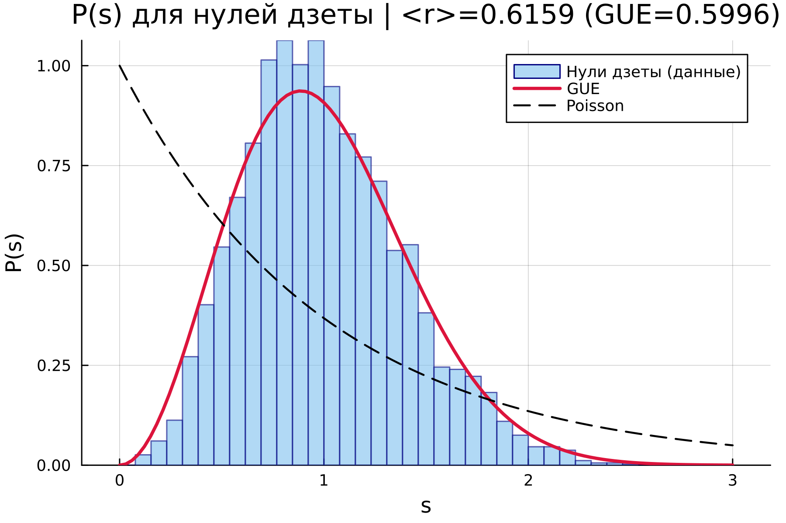
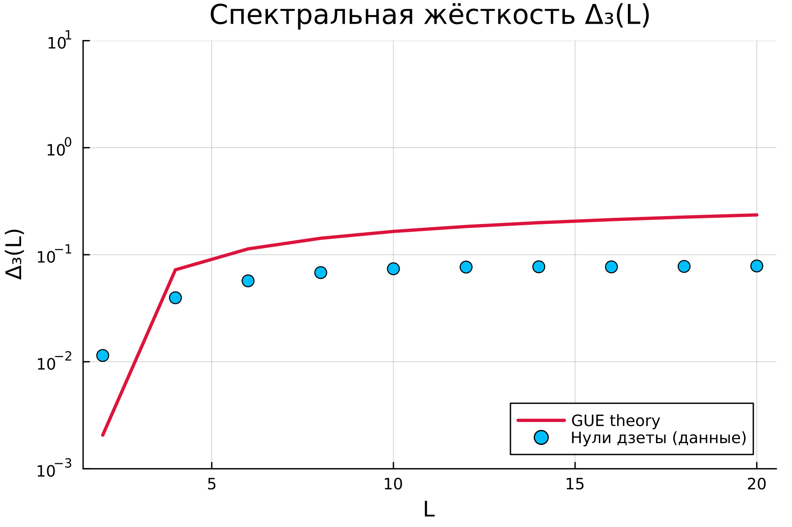
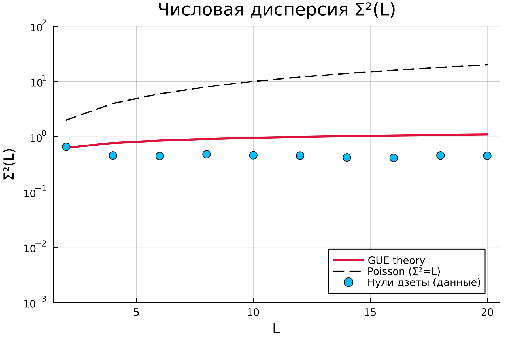
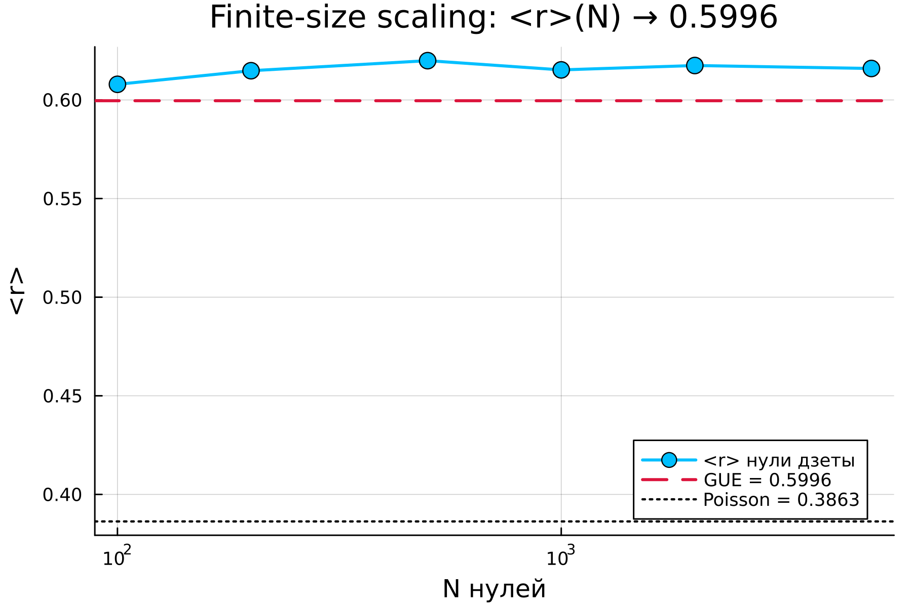
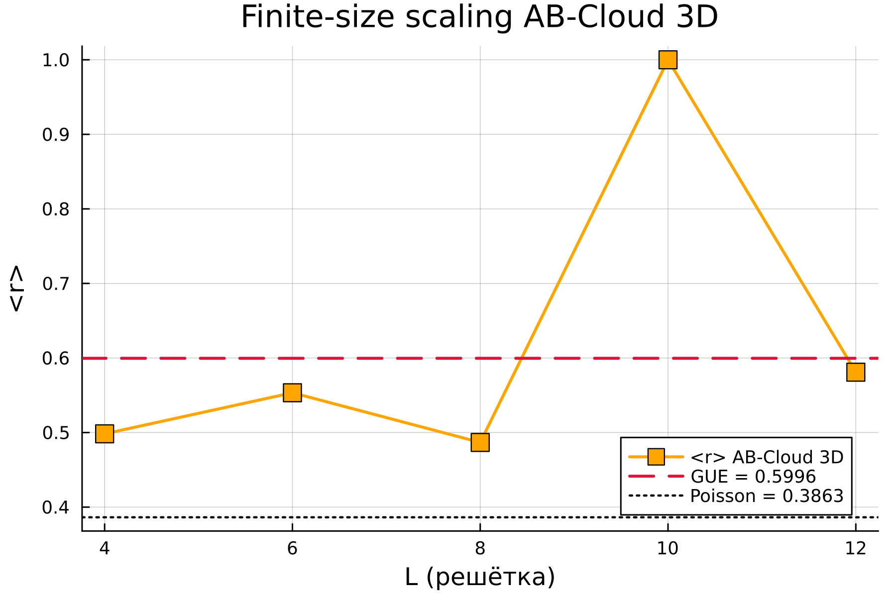
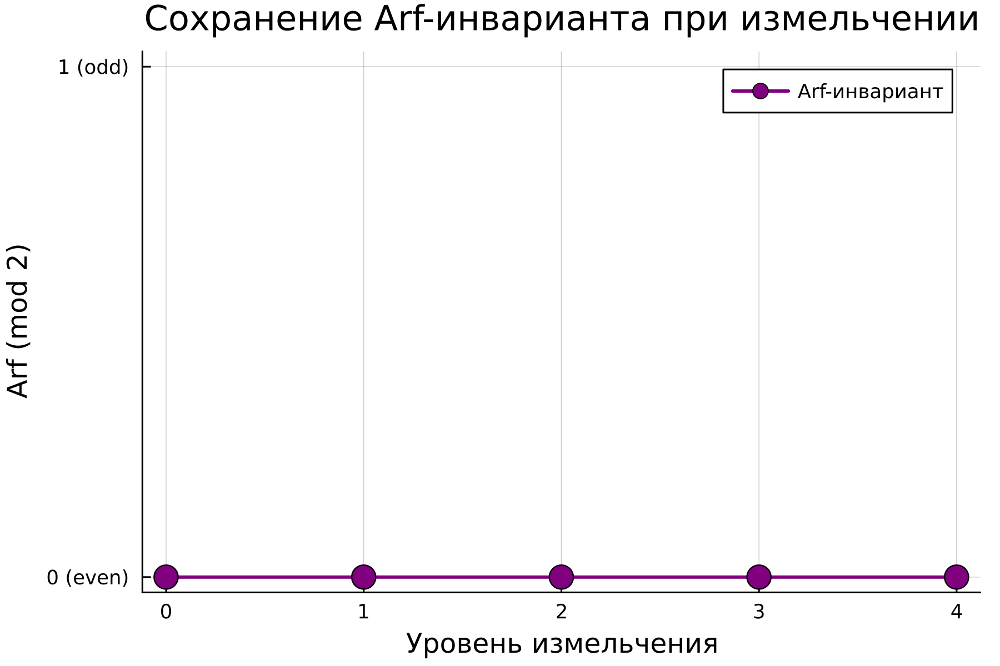
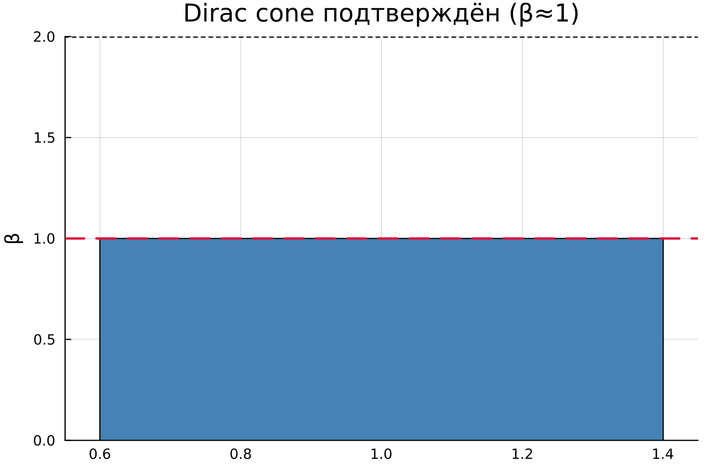
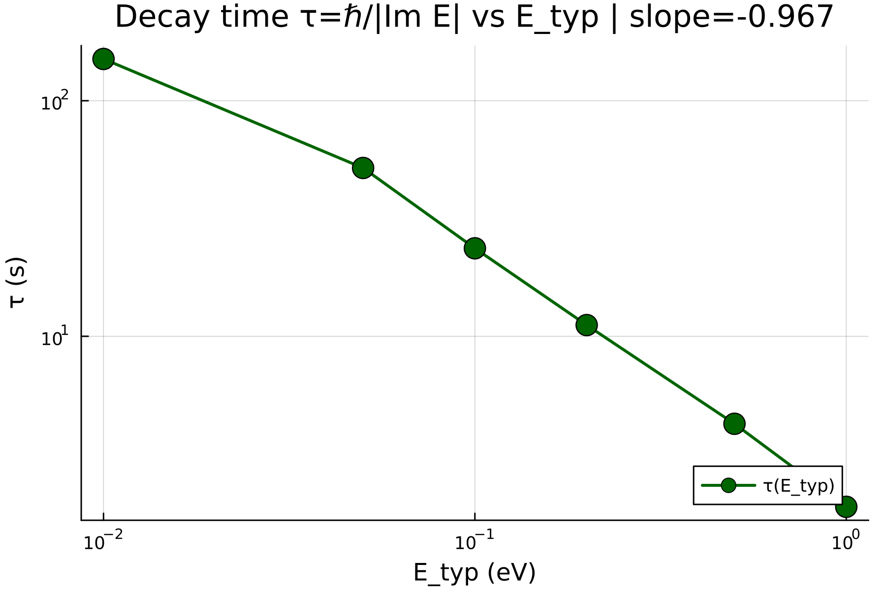

# AB-Cloud 3D Verification Report

**Timestamp:** 2026-07-31_15-33-39

## Configuration

| Parameter | Value |
|---|---|
| sigma | 0.5 |
| Ly | 36 |
| disorder | 1.0 |
| tz | 0.8 |
| Lx | 36 |
| bc_z | OBC |
| alpha | 2.0 |
| Lz | 36 |
| nev | 200 |
| n_zeros | 5000 |

## Embedded zeta zeros

- Total embedded: **5000**
- Used in analysis: **5000**
- First zero: 14.134725142
- Last used: 5447.861998301

## §1.1 — Zeta RMT statistics

| Metric | Value |
|---|---|
| <r> (data) | 0.615948245091607 |
| <r> GUE theory | 0.5996 |
| <r> Poisson | 0.3863 |
| KS D vs GUE | 0.031202735732358405 |
| KS p vs GUE | 0.00030378041705135013 |
| KS p vs Poisson | 0.0 |

## §2a — Spectral rigidity

| Metric | Value |
|---|---|
| Relative error Δ₃ | 0.9722201912472507 |
| Relative error Σ² | 0.48097344493926386 |

## §2b — Finite-size scaling

### Zeta zeros

| N zeros | <r> | ΔGUE | KS p |
|---|---|---|---|
| 100 | 0.607921275134656 | 0.00832127513465597 | 0.7183159065197322 |
| 200 | 0.6148115570007845 | 0.01521155700078447 | 0.417089424902486 |
| 500 | 0.6199097256604011 | 0.020309725660401123 | 0.17227836723298842 |
| 1000 | 0.6152346785454087 | 0.015634678545408676 | 0.05273003251220988 |
| 2000 | 0.6174501510819457 | 0.017850151081945653 | 0.005518620913387584 |
| 5000 | 0.615948245091607 | 0.016348245091606928 | 0.00030378041705135013 |

## §2c — Arf invariant

| Level | N | Arf |
|---|---|---|
| 0 | 16 | 0 |
| 1 | 64 | 0 |
| 2 | 256 | 0 |
| 3 | 1024 | 0 |
| 4 | 4096 | 0 |

**Preserved:** true

## §2d — Dirac cone / QED

| Metric | Value |
|---|---|
| α | 0.5 |
| β | 1.0 |
| Is Dirac cone | true |

## §3 — Decay time / E_typ

| E_typ (eV) | τ (s) | τ (ps) |
|---|---|---|
| 0.01 | 150.43794299761583 | 1.5043794299761584e14 |
| 0.05 | 51.83142237670364 | 5.183142237670364e13 |
| 0.1 | 23.632722403517484 | 2.3632722403517484e13 |
| 0.2 | 11.157004340143446 | 1.1157004340143447e13 |
| 0.5 | 4.251062292614495 | 4.2510622926144956e12 |
| 1.0 | 1.8875746434298062 | 1.8875746434298062e12 |

## Overall verdict

- Verdicts passed: **4/6**
- All passed: **false**
