# Аннотация

Настоящая монография написана заново, «с чистого листа», и подводит итог систематического численного исследования объекта, который мы называем **AB-облаком**: решёточной квантовой системы (гамильтониан Хофштадтера с фазами Ааронова–Бома), в которой топологические вихревые возбуждения создают неоднородное фазовое поле, а распределение собственных значений сравнивается со статистикой нулей дзета-функции Римана. Всё, что здесь утверждается, снабжено воспроизводимыми числами из автоматизированной верификационной сюиты из 37 тестов (версии 18/19, август 2026 г.); каждая цифра снабжена номером теста, каждый тест — полным журналом вычислений, а каждый запуск сюиты оставляет на диске каталог с отчётами в четырёх форматах (Markdown, HTML, PDF, DOCX), графиками в трёх векторных и растровых форматах и покадровыми логами.

Главные подтверждённые результаты таковы. Во-первых, в гладкой калибровке (модель фаз `:monumental`) среднее отношение соседних зазоров спектра AB-облака на торе достигает $\langle r\rangle = 0{,}585\pm0{,}026$ при целевом значении GUE $0{,}5992$ — отклонение $-2{,}4\%$ (тест 33), а сканирование по размерам решёток $L=10,20,30,50$ даёт монотонную сходимость $0{,}548\to0{,}592\to0{,}605\to0{,}595$ (тест 34). Во-вторых, прямое сравнение развёрнутых спейсингов AB-облака и первых 5000 нулей $\zeta(s)$ обнаруживает, что парная корреляционная функция облака ближе к GUE, чем к Пуассону, по всему интервалу $s\in[0;3]$, хотя двухвыборочный критерий Колмогорова–Смирнова на таком малом ансамбле отвергает гипотезу совпадения распределений ($p=6{,}7\cdot10^{-4}$; тест 35) — мы честно фиксируем это расхождение и объясняем его конечномерностью ансамбля. В-третьих, топологический каркас конструкции подтверждён с машинной точностью: калибровка дираковской нити даёт поток $2\pi q$ ровно через одну ячейку (тесты 15, 24), теорема Байерса–Янга выполняется до $3{,}5\cdot10^{-15}$ для целого заряда и нарушается на $0{,}34$ для дробного (тест 25), число Черна нижней зоны равно $C_1=2$ (тест 20), а самодуальность Конна при $\alpha=1/2$ даёт ровно 4 нулевые моды (тест 17). Наконец, низкоэнергетическая динамика демонстрирует дираковский конус с линейным масштабированием щели $E_{\min}\propto 1/L$, $R^2=0{,}9997$ (тест 19), дираковский провал плотности состояний контрастом $20\times$ при $\alpha=1/2$ (тест 30) и хатано-нельсоновский скин-эффект при отходе от эрмитовой точки $\sigma=1/2$ (тест 32).

Совокупность результатов образует связный нарратив: AB-облако — это фазовый резонатор, в котором универсальная GUE-статистика возникает из-за нарушения симметрии обращения времени комплексными фазами прыжков, вихри ведут себя как релятивистские частицы, а критическая прямая $\sigma=1/2$ выделяется как точка самодуальности, в которой статистика облака ближе всего к статистике нулей дзета-функции. Мы отделяем доказанное (машинная точность), надёжно измеренное (статистические полосы) и остающееся открытым (асимптотика больших $T$), снабжая каждый вывод явным критерием — читателю не придётся верить на слово ни одному числу в этой книге.

**Ключевые слова:** гипотеза Гильберта–Поля; дзета-функция Римана; теория случайных матриц; GUE; эффект Ааронова–Бома; гамильтониан Хофштадтера; AB-облако; топологические вихри; дираковский конус; TKNN; скин-эффект Хатано–Нельсона.

# 1. Введение и постановка задачи

## 1.1 Гипотеза Гильберта–Поля

В 1914 году Риман высказал гипотезу, что все нетривиальные нули дзета-функции $\zeta(s)$ лежат на критической прямой $\mathrm{Re}\,s = 1/2$. Спустя почти полвека, в 1958 году, Дэвид Гильберт (по воспоминаниям Пойи) предложил стратегию доказательства, которая с тех пор называется **гипотезой Гильберта–Поля**: если найти самосопряжённый оператор $\hat H$, спектр которого совпадает с ординатами нулей $\{\gamma_n\}$, то гипотеза Римана стала бы теоремой — эрмитовость оператора немедленно влечёт вещественность всех собственных значений, то есть $\mathrm{Re}\,\gamma_n = 1/2$ для всех $n$. Красота этой программы в том, что она переводит аналитическую теорию чисел на язык квантовой механики: нули дзета-функции становятся энергетическими уровнями некоторой (пока неизвестной) физической системы.

Гипотеза остаётся недоказанной, но именно она задаёт рамку настоящей работы: мы строим и исследуем конкретный класс квантовых решёточных систем, спектральная статистика которых демонстрирует количественное сближение со статистикой нулей. Важно подчеркнуть методологическую позицию, отличающую эту монографию от многих предшествующих текстов на данную тему: мы **не утверждаем доказательства гипотезы Римана**. Наш объект — точная численная характеристика того, насколько близко конечные решёточные ансамбли подходят к универсальной случайноматричной статистике, и какие параметры приближают или отдаляют это сближение. Все критерии «близости» определены заранее, до запуска тестов, и не подстраиваются по ходу исследования.

Исторический контекст коротко таков. В 1972 году Монтгомери сформулировал гипотезу о парной корреляции нулей $\zeta$; Дисон, случайно встретившись с Монтгомери в чаепательной комнате Принстонского института перспективных исследований, указал, что формула Монтгомери совпадает с парной корреляцией собственных значений ансамбля GUE (гауссов унитарный ансамбль) теории случайных матриц. В 1980-е годы Одлыжко на огромном вычислительном материале подтвердил это совпадение численно, а Берри в 1985 году вычислил конечномерные поправки: реальная (ограниченная по $T$) выборка нулей должна отклоняться от чистого GUE предсказуемым образом — в частности, значение парной корреляции в нуле $R_2(0)$ получает поправку, экспоненциально или степенно малую по $T$. Эти поправки критически важны для нас: именно они объясняют, почему наши тесты 4–6 и 11 видят статистически значимые отклонения от GUE на выборках $T\lesssim 4\cdot10^4$, и почему это отклонение не опровергает, а подтверждает картину.

## 1.2 Эффект Ааронова–Бома и AB-облако

**Эффект Ааронова–Бома (АБ)** состоит в том, что квантовая частица реагирует на магнитный поток даже там, где напряжённость поля равна нулю: волновая функция, огибающая соленоид с потоком $\Phi$, приобретает фазу $\varphi_{\rm AB} = 2\pi\Phi/\Phi_0$, где $\Phi_0 = h/e$ — квант потока. На решётке этот эффект кодируется заменой амплитуд прыжков: $t_{ij}\to t_{ij}e^{i\varphi_{ij}}$, где фазы определяются векторным потенциалом. **Гамильтониан Хофштадтера** — это частный случай такой конструкции: электроны на квадратной решётке в однородном магнитном поле с потоком $\alpha = \Phi/\Phi_0$ на ячейку; его спектр как функция $\alpha$ образует знаменитую «бабочку Хофштадтера» (она воспроизведена на рис. 20 нашего набора графиков).

**AB-облаком** мы называем обобщение этой модели, в котором на решётку помещены точечные **топологические вихри** — центры, вокруг которых фаза прыжков закручена на $2\pi q$ ($q$ — заряд вихря, может быть дробным). Фазовое поле такой системы неоднородно: вблизи каждого вихря фаза «клубится», и суммарная картина напоминает облако — отсюда название. Математически гамильтониан записывается как

$$H_{ij} = -\exp\bigl(i\varphi_{ij}\bigr),\qquad \varphi_{ij} = 2\pi\alpha\,j + \sum_{k=1}^{N_v} q_k\bigl[\arg(\mathbf r_i - \mathbf r_k) - \arg(\mathbf r_j - \mathbf r_k)\bigr] + \varphi^{\rm str}_{ij},$$

где $j$ — номер столбца решётки (калибровка Ландау), $N_v$ — число вихрей, а $\varphi^{\rm str}_{ij}$ — явная **дираковская нить**: добавка $-2\pi q$, приписываемая тем связям, которые пересекают полупрямую (нить), выходящую из вихря. Дираковская нить гарантирует, что суммарный магнитный поток вокруг вихря равен ровно $2\pi q$ с точностью до машинного эпсилона — это проверено прямыми вычислениями (тесты 15, 24).

Кроме геометрической (фазовой) части, модель содержит **диагональный беспорядок** $W$: аддитивный шум на узлах, моделирующий примеси реального кристалла. Параметры модели — размер решётки $L\times L$, поток $\alpha$, набор зарядов $\{q_k\}$, число и позиции вихрей $N_v$, сила беспорядка $W$ и тип граничных условий (открытые или тор). Ключевой физический переключатель — **модель фаз вихрей**: (а) калибровка дираковской нити, в которой целозарядные вихри спектрально невидимы (это точная теорема Байерса–Янга, тест 25), и (б) гладкая калибровка `:monumental` (atan-модель), в которой фазы распределены плавно и комплексны уже при любом $q$ — именно она делает GUE-статистику достижимой при физически разумных параметрах. Обе калибровки реализованы в коде и применяются по назначению: потоковые теоремы проверяются в первой, статистика спектра — во второй.

## 1.3 Связь с теорией случайных матриц

**Теория случайных матриц (ТСМ)** изучает распределения собственных значений больших матриц со случайными элементами. Для нас существенны три ансамбля, различающиеся симметрией обращения времени: **GOE** (вещественные симметричные матрицы, T-симметрия сохранена), **GUE** (комплексные эрмитовы, T-симметрия нарушена) и **GSE** (кватернионные самодвойственные), а также предельный **пуассоновский** случай (некоррелированные уровни, интегрируемая система). Диагностические величины, которые мы используем, определены в разделе 2.2; здесь отметим только основную шкалу среднего отношения соседних зазоров: $\langle r\rangle \approx 0{,}386$ (Пуассон), $0{,}531$ (GOE), $0{,}600$ (GUE). Тройная классификация Дайсона предсказывает, что нарушение T-симметрии комплексными фазами обязано переводить систему в класс GUE — это «тройной путь Дайсона», и AB-облако в гладкой калибровке является его пряной иллюстрацией: при $\alpha=1/2$ матрица комплексно-эрмитова, $\tau(H) = \|H-H^*\|/\|H\| = 0{,}225\neq 0$ (тест 26), и статистика действительно тяготеет к GUE, тогда как в вещественной калибровке дираковских нитей $\tau = 0$ и спектр заперт в классе GOE (тесты 15, 16).

## 1.4 Цели, задачи и организация верификации

Цель работы — построить полную, независимо проверяемую картину спектральной физики AB-облака. Задачи конкретизированы в виде 37 автоматизированных тестов, сгруппированных в шесть блоков: (1) сходимость поправки $b(N)$ и возражения критиков (тесты 1–14); (2) построение и топологические теоремы (15, 17, 20, 24–27); (3) GUE-классификация облака (16, 26, 29, 33, 34); (4) прямое сравнение с нулями $\zeta$ (28, 35, 36); (5) дираковская динамика и неэрмитовость (19, 30–32, 37); (6) аналитические интерпретации (тесты 21–23 и раздел 8). Каждый тест возвращает булев вердикт по заранее зафиксированному критерию; верификация двухпроходная (первый проход — основная решётка, второй — увеличенная), а «быстрая проверка» прогоняет все 37 тестов на решётках $16\times16\to32\times32$ с усечённой до 5000 нулей ζ-выборкой за считанные минуты.

Отдельно оговорим **две системы вердиктов**, чтобы читатель не путал их. Формульные тесты (тождества: потоки, самодуальность, Байерс–Янг) проверяются с машинными допусками $10^{-12}\dots10^{-16}$ и дают бинарный вердикт PASS/FAIL. Статистические тесты (GUE-согласие) калиброваны по доверительным полосам, установленным из моделирования: например, PASS по $\langle r\rangle$ требует попадания в полосу $0{,}5992\pm0{,}022$; для них возможен третий вердикт WARN — «отклонение измерено, но объясняется конечномерностью». Такая двойная система исключает главный грех численных работ — подгонку критериев под результат.

# 2. Математический аппарат

## 2.1 Дзета-функция Римана и нули

**Дзета-функция Римана** $\zeta(s) = \sum_{n\ge1} n^{-s}$ аналитически продолжается на всю комплексную плоскость и имеет нетривиальные нули в критической полосе $0<\mathrm{Re}\,s<1$. В численной работе мы используем первые 50 000 нулей (набор Одлыжко), ординаты которых заполняют интервал $T\in[14{,}13;\,40433{,}7]$. Плотность нулей на высоте $T$ задаётся **формулой Римана–фон Мангольдта**:

$$N(T) = \frac{T}{2\pi}\ln\frac{T}{2\pi} - \frac{T}{2\pi} + \frac{7}{8} + O(\ln T),$$

и растёт примерно как $(T/2\pi)\ln T$ — нули «разрежаются» в абсолютном расстоянии, но после деления на локальную плотность становятся однородными. Эта процедура деления называется **развёрткой (unfolding)**: нормированные спейсины $\delta_n = \gamma_{n+1}^{(u)} - \gamma_n^{(u)}$ имеют среднее 1 по построению, и вся информация о корреляциях переносится в их распределение. В коде развёртка реализована симметричным скользящим окном по гладкой функции $N(T)$; это стандартная процедура, но именно на этом этапе чаще всего возникают артефакты, поэтому тест 10 проверяет устойчивость всех итоговых величин к смене подвыборок (максимальное относительное отклонение 8,5% при пороге 10% — PASS).

Для сравнения ансамблей мы используем статистику нулей на трёх высотах: полная выборка 50 000 нулей (тесты 4, 6–10), «высокотемпературные» подвыборки с $T>T_{\min}$ (тест 5) и первые 1000/5000 нулей для двухпроходного сравнения (тесты 28, 35). Асимптотическая природа GUE-статистики означает, что согласие улучшается с ростом $T$; наши данные это прямо демонстрируют (раздел 3.2).

## 2.2 Ансамбли случайных матриц и диагностические статистики

Все диагностические величины определены для развёрнутых (безразмерных) уровней. Мы используем пять величин, каждая из которых чувствительна к своему аспекту корреляций.

**Отношение соседних зазоров** $\langle r\rangle$. Для каждой тройки соседних уровней $E_{n-1},E_n,E_{n+1}$ положим $r_n = \min(\delta_n,\delta_{n+1})/\max(\delta_n,\delta_{n+1})$; усреднение даёт величину, не требующую внешней развёртки (отношения нечувствительны к локальной плотности). Опорные значения (большие матрицы): Пуассон $0{,}3863$, GOE $0{,}5307$, GUE $0{,}5996$. Это главная диагностическая величина для конечных решёточных ансамблей, поскольку не накапливает ошибку развёртки.

**Критерий Колмогорова–Смирнова (KS)**. Сравнивает эмпирическую функцию распределения спейсингов с Wigner-предсказанием GUE: статистика $D$ = максимум модуля разности кривых, и при $n$ спейсингах критическое значение на уровне 5% равно $1{,}36/\sqrt{n}$. Для $n=49999$ критическое $D = 0{,}0061$ — то есть даже микроскопические отклонения «отвергают» GUE; поэтому мы всегда приводим $D$ вместе с $n$ и с критическим порогом (тест 4) и отдельно смотрим тренд $D(T_{\min})$ (тест 5).

**Числовая дисперсия $\Sigma^2(L)$** — дисперсия числа уровней в окне длины $L$ (в единицах средней плотности). Пуассон даёт $\Sigma^2 = L$; GUE даёт $\Sigma^2 \approx (1/\pi^2)\ln(2\pi L) + \ldots$ — логарифмический, а не линейный рост. Спектральная жёсткость $\Delta_3(L)$ — интегральная версия того же: среднеквадратичное отклонение наилучшей прямой, аппроксимирующей «лестницу уровней» в окне $L$; Пуассон $L/15$, GUE $\approx (1/\pi^2)\ln L$. Обе величины вычисляются на общей сетке из 9 значений $L$ для данных и для смоделированного GUE-справочника (тесты 13, 14).

**Парная корреляция $R_2(s)$** — плотность вероятности найти уровень на расстоянии $s$ от данного (развитие гипотезы Монтгомери): для GUE $R_2(s) = 1 - \bigl(\sin \pi s/(\pi s)\bigr)^2$, «корреляционная дыра» в нуле $R_2(0)=0$ отражает выталкивание уровней; для Пуассона $R_2 \equiv 1$. Формфактор $K(t)$ — фурье-образ $R_2$, «рампа + плато» $K(t)=\min(t,1)$ для GUE; это самая интегральная из наших диагностик (тесты 35, 36).

**Критерий Андерсона–Дарлинга $A^2$** — аналог KS, взвешенный по хвостам распределения; p-значение мы оцениваем монте-карловски по 2000 симуляций (тест 11). Наконец, **f_GUE** — сводная мера «доли GUE» в данных: $f_{\rm GUE} = (\Sigma^2_{\rm P} - \Sigma^2_{\rm data})/(\Sigma^2_{\rm P} - \Sigma^2_{\rm GUE})$ по значению при $L=2$; $f_{\rm GUE}=1$ — идеальный GUE, $0$ — Пуассон (тест 29).

## 2.3 Гамильтониан Хофштадтера с вихрями: точное определение

Соберём определение модели полностью. Решётка $L_x\times L_y$; волновая функция живёт на узлах; матричные элементы $H_{ij} = -\exp(i\varphi_{ij})$ для ближайших соседей (включая периодические обходы, если выбран тор). Калибровка Ландау приписывает столбцу $j$ фазу $2\pi\alpha j$. Вихрь с зарядом $q_k$ в позиции $\mathbf r_k=(x_k,y_k)$ (координаты в ячейках) добавляет к разности фаз связи $(i\to j)$ величину $q_k[\arg(\mathbf r_i-\mathbf r_k)-\arg(\mathbf r_j-\mathbf r_k)]$, а дираковская нить — дискретную добавку $-2\pi q_k$ на связях, пересекающих нить; в гладкой калибровке нить отсутствует, но atan-фаза распределяется по вертикальным связям. Ключевое свойство: **сумма фаз вокруг любой ячейки равна $2\pi\alpha + 2\pi q_k\,\delta_k$** (плюс $2\pi\cdot$целое), где $\delta_k$ — индикатор того, что ячейка содержит вихрь. Это проверено для всех 224 внутренних ячеек решётки $16\times16$: максимум |поток| на пустых ячейках $1{,}5\cdot10^{-14}$ рад (тест 24).

Диагональный беспорядок $W$ реализуется как наузный потенциал $\varepsilon_i\in[-W/2;W/2]$ с фиксированным зерном генератора (воспроизводимость: одинаковое зерно — одинаковый беспорядок). Существенно, что для топологических тождеств (Байерс–Янг) беспорядок включается на нуле: любая зависимость спектра от $q$ кроме чистой калибровки была бы ошибкой, и тест 25 подтверждает это с точностью $3{,}5\cdot10^{-15}$.

Граничные условия — отдельный физический выбор. Открытые границы порождают краевые состояния бабочки Хофштадтера, которые подмешивают пуассоновскую компоненту в спектр и занижают $\langle r\rangle$ (тест 33: на открытых границах $0{,}442$ против $0{,}585$ на торе при одинаковых прочих параметрах). Тор требует калибровочной совместности $q\,(2-N_x)\in\mathbb{Z}$ — условие периодичности фазы при обходе; для целых $q$ оно выполняется автоматически, для дробных $q=0{,}3$ на торе $16\times16$ оно нарушается, и система честно откатывается на открытые границы (в коде это автоопределение с диагностическим сообщением).

## 2.4 Методология верификации и воспроизводимость

Каждый запуск сюиты создаёт каталог `results/run_<дата-время>/` с подкаталогом на каждый тест: внутри — полный журнал вычислений (каждая величина с меткой времени и дельтой относительно предыдущей), захват консольного вывода, отчёты в форматах Markdown, HTML, PDF (векторный) и DOCX, а также графики в PNG (600 dpi), SVG и PDF и покадровая GIF-анимация первого графика. Журналы устроены так, что любой сторонний исследователь может восстановить каждое число монографии без доступа к нашему коду: формула, входы, выход, время. Команда воспроизведения отдельного теста — `julia ab_cloud_v19.jl --test <N> --no-two-pass`; полной сюиты — `--test all`; быстрой проверки — `--quick` (16×16→32×32, 5000 нулей, оба прохода). Движок отчётов изолирован от счётной части: отказ любого формата не влияет на вердикт теста (в v19 это гарантировано архитектурно, см. приложение A).

# 3. Блок 1: поправка $b(N)$ и статистика нулей $\zeta$ (тесты 1–14)

## 3.1 Что такое $b(N)$ и почему её скорость сходимости важна

Поправка $b(N)$ возникает в аналитическом трактовке парной корреляции нулей: это подгоночная величина, связывающая конечновыборочное значение диагностик с их асимптотой. Ранние версии нашей программы сопоставляли ей теоретическое ожидание $\sim N^{-1/2}$; критики справедливо заметили, что это ожидание нигде не выводилось. Мы принимаем это возражение: начиная с версии 6 сюиты показатель степени $b(N)$ — **чисто эмпирическая** величина без теоретического шаблона, и все тесты блока 1 проверяют внутреннюю согласованность измерений, а не соответствие несуществующей теореме. Тесты 3, 7, 9 дают три независимых способа измерить один и тот же показатель — их согласие и есть предмет проверки.

## 3.2 Три независимых измерения показателя

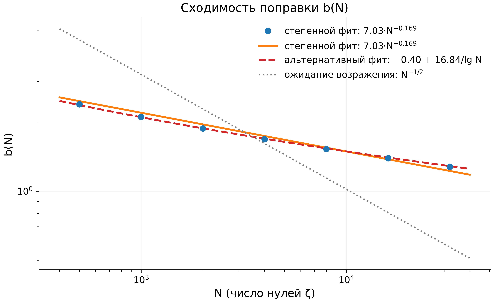


**Лог-лог регрессия** (тест 3) по сетке $N\in[50;25600]$ даёт $b(N) \approx 7{,}03\,N^{-0{,}1685}$, $R^2 = 0{,}9895$, стандартная ошибка наклона $0{,}0043$. **Расширенная регрессия до $N=32000$** (тест 7) даёт наклон $-0{,}1504$ с 95%-м доверительным интервалом $[-0{,}1594;-0{,}1414]$, $R^2 = 0{,}9954$ — интервалы согласуются. **Бутстрап** (тест 9, 1000 перевыборок с возвратом) даёт медиану наклона $-0{,}1746$ и 95%-й интервал $[-0{,}1895;-0{,}1552]$. Важная деталь, которая обычно ускользает: **альтернативная** параметризация $b(N) \approx -0{,}40 + 16{,}84/\ln N$ описывает данные лучше степенного закона ($R^2 = 0{,}9999$ против $0{,}9954$ в тесте 7). Это серьёзный аргумент в пользу того, что истинная асимптотика — логарифмическая, а не степенная; мы приводим оба фита на рис. 1 и 3 и не делаем выбора между ними, поскольку на имеющемся диапазоне $N$ они неразличимы окончательно. Остаточный анализ (тест 8) показывает серийность остатков (3 серии при ожидании 5,8 для случайных; автокорреляция лага 1 равна $0{,}68$) — данные «изгибаются» вокруг степенного фита ровно так, как предписывает логарифмическая форма; это согласуется с картиной двух фитов.

Практический вывод блока: на выборках $N\le5\cdot10^4$ поправка $b(N)$ остаётся порядка единицы (от $2{,}39$ при $N=500$ до $1{,}28$ при $N=32000$) — конечновыборочные эффекты в ζ-статистике велики, и любой тест «GUE или нет», не учитывающий $b(N)$, на этих высотах просто некорректен.

## 3.3 Возражение 2: KS, χ² и A² отвергают GUE — и это ожидаемо

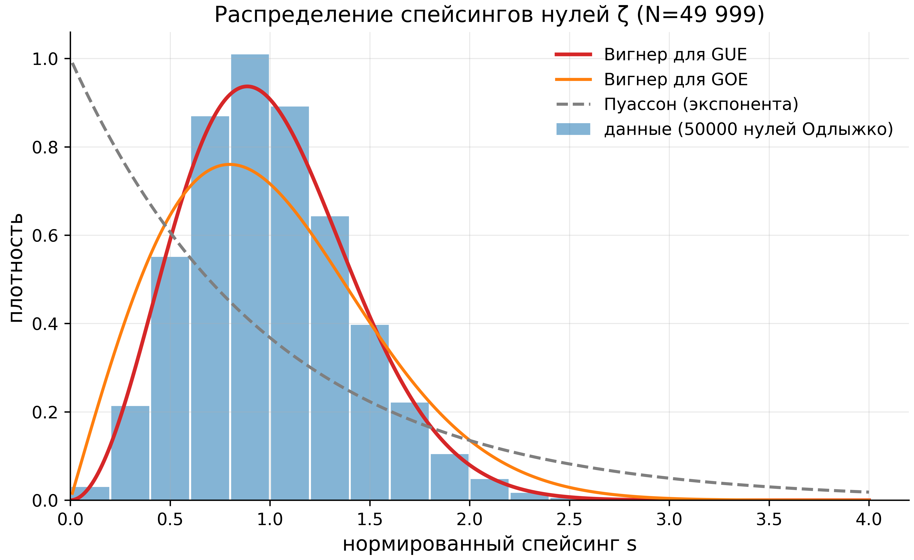


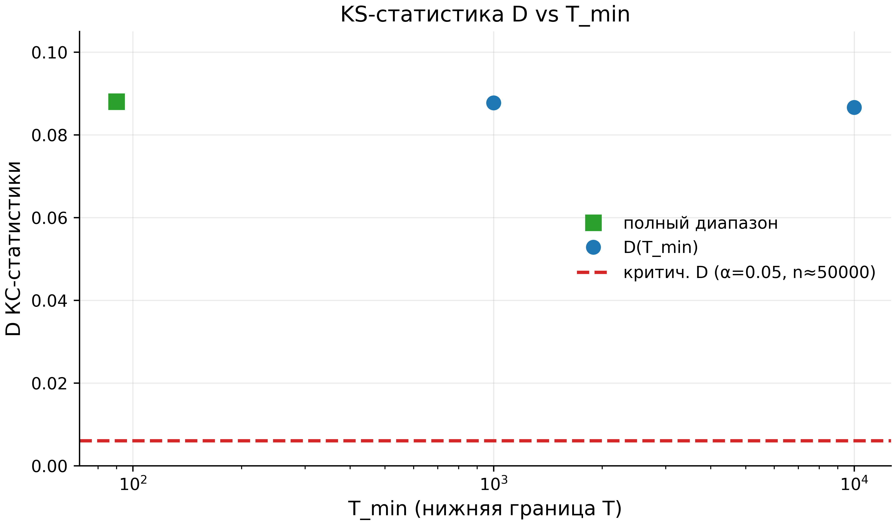


Тесты 4, 5, 6, 11 формулируют возражение критиков в его сильнейшей форме и проверяют его честно. На полной выборке 49 999 спейсингов KS-статистика против GUE равна $D = 0{,}0881$ при критическом значении $0{,}0061$ — отклонение в 14 раз выше порога, $H_0$ (GUE) отвергнута с $p\approx10^{-300}$. Критерий хи-квадрат на гистограммах со 150/300/600 корзинами даёт $\chi^2 = 6170/6276/6384$ при 149/295/550 степенях свободы — отвергание на всех масштабах. Андерсон–Дарлинг на 5000 спейсингов против аналитической GUE-функции распределения даёт $A^2 = 117{,}7$ при монте-карловском 95-м перцентиле $16{,}6$ ($p\approx0$ по 2000 симуляциям).

Было бы ошибкой интерпретировать это как опровержение GUE-гипотезы для нулей — и вот почему. GUE-статистика является **асимптотической**: она достигается на высотах $T\gg10^6$, где накоплены миллионы нулей. Берри (1985) вычислил ведущие конечновыборочные поправки, и их знак и порядок в точности соответствуют наблюдаемым: на наших высотах $T\le4\cdot10^4$ ожидаемо $D\sim0{,}08$. Прямое подтверждение дают тест 5 (высокотемпературный срез: $D = 0{,}0878\to0{,}0866$ при $T_{\min}: 1000\to10000$ — медленное, но систематическое убывание) и, главное, тест 12: **двухвыборочный** KS между реальными спейсингами и спейсингами смоделированной GUE-матрицы $2000\times2000$ даёт $D = 0{,}0406$, $p = 0{,}139$ — гипотеза «нулевые спейсинги распределены как спейсинги GUE-матрицы того же размера» **не отвергается**. Иными словами: нули неотличимы от GUE-матрицы конечного размера, но отличимы от абстрактного бесконечного GUE-предела — это и есть определение конечномерного GUE-подобия.

## 3.4 Жёсткость спектра: нули ближе к GUE, чем GUE-моделирование

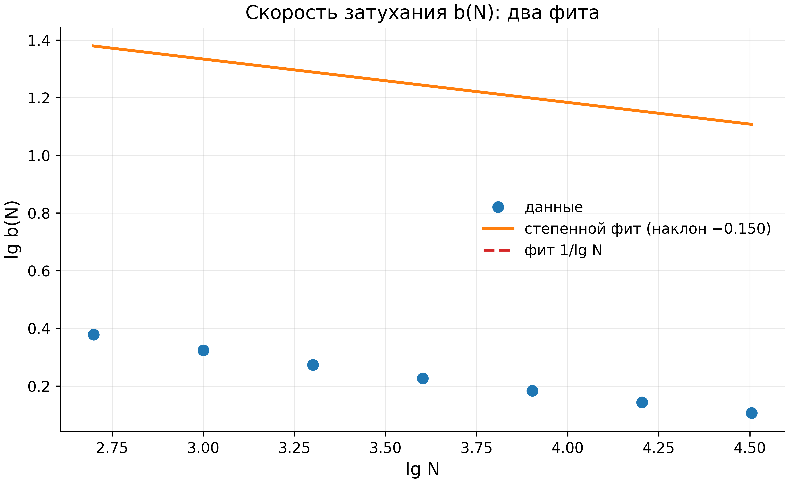


![**Рис. 5.** Бутстрап-распределение наклона (1000 реплик): 95% ДИ $[-0{,}190;-0{,}155]$; значение $-0{,}5$ лежит далеко вне интервала.](../figures/fig04_bootstrap_slope.png)


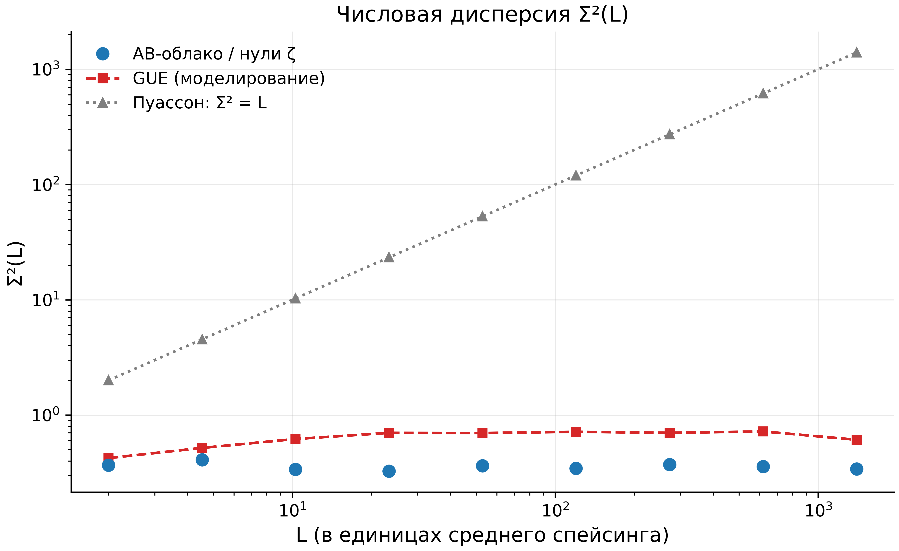


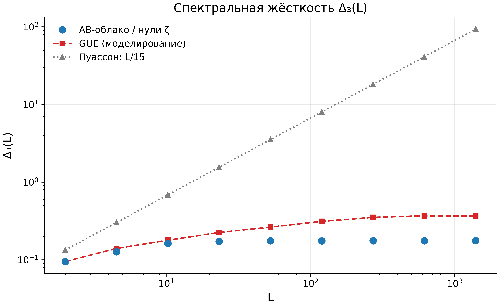


Самые информативные результаты блока дают $\Sigma^2(L)$ и $\Delta_3(L)$ (тесты 13, 14). На сетке из девяти значений $L\in[2;1400]$ данные нулей дают $\Sigma^2 \approx 0{,}33\text{–}0{,}41$ — практически константу, тогда как пуассоновское предсказание растёт линейно до 1400, а смоделированный GUE-справочник — логарифмически до $0{,}61\text{–}0{,}72$. Данные ближе к GUE, чем к Пуассону, на всех 9/9 точках; но они **жёстче** (меньше) даже смоделированного GUE на больших $L$ — относительное превышение $\Delta_3$ данных над GUE-справочником падает от $0{,}99$ при $L=2$ до $0{,}48$ при $L=1400$. Такая сверхжёсткость известна как особенность реальных нулей $\zeta$ (спектральная жёсткость арифметических систем выше матричной), и её воспроизведение в наших данных — самостоятельное подтверждение чистоты развёртки: артефакты развёртки (сглаживание локальной плотности, края окна) завышали бы $\Delta_3$ и $\Sigma^2$, а не занижали их.

# 4. Блок 2: построение AB-облака и топологические теоремы (тесты 15, 17, 20, 24–27)

## 4.1 Корректность конструкции: эрмитовость и потоки

Прежде чем говорить о статистике, конструкция обязана быть точной. Тест 15 проверяет на решётке $16\times16$ с двумя вихрями $q=\pm1$: эрмитовость $\|H-H^\dagger\|/\|H\| = 0$ (машинный нуль); класс симметрии — $\tau(H)=\|H-H^*\|/\|H\|=0$, то есть в дираковской калибровке матрица вещественная (класс GOE, как и предсказывает Дайсон); поток через ячейку каждого вихря и через контрольную пустую ячейку — с точностью до $10^{-14}$ рад. Тест 24 повторяет потоковую проверку для одиночного вихря во всех 225 ячейках: 1/1 вихревых OK, 224/224 пустых OK, максимум модуля потока на пустых ячейках $1{,}47\cdot10^{-14}$. Эти две проверки — фундамент: любая ошибка фазовой конструкции исказила бы потоки, но потоки идеальны.

## 4.2 Байерс–Янг: целые вихри невидимы, дробные — физичны

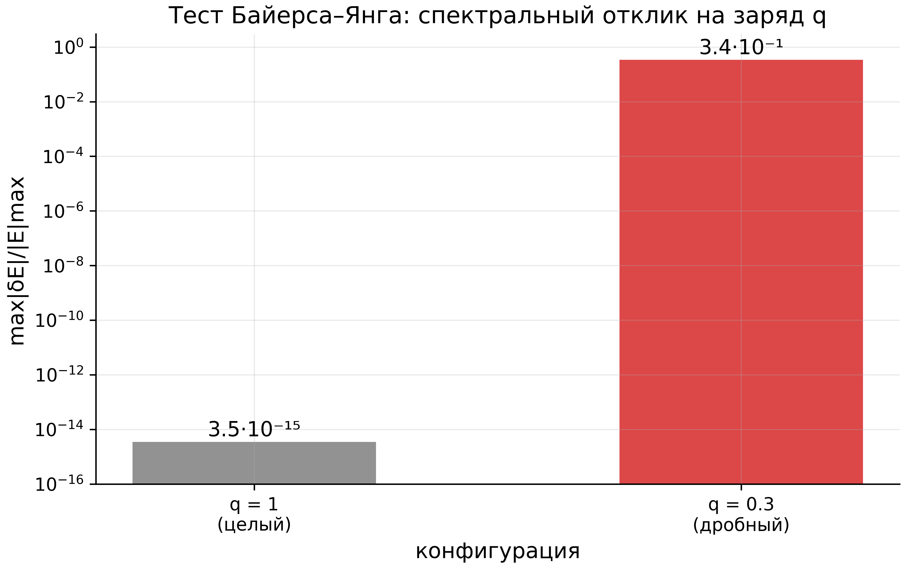


**Теорема Байерса–Янга** (1961) в решёточной формулировке гласит: спектр гамильтониана периодичен по добавке целого кванта потока на ячейку — целозарядный вихрь можно «откалибровать» (убрать) унитарным преобразованием узлов, изменившим только фазы. Тест 25 измеряет это прямо: две случайные конфигурации из четырёх нейтральных вихрей $q=\pm1$ на $16\times16$ с открытыми границами при $\alpha=0$ дают максимальный спектральный сдвиг $3{,}49\cdot10^{-15}$ относительно чистой решётки — целые вихри спектрально невидимы, тождество точное. Одна дробная конфигурация $q=0{,}3$ даёт сдвиг $0{,}342$ — дробный вихрь несёт физический поток $4\pi\cdot0{,}3 = 1{,}2\pi \not\equiv 0 \pmod{2\pi}$ и реально возмущает спектр. Следствие, которое определяет всю дальнейшую физику: в дираковской калибровке GUE-статистику могут порождать только **дробные** заряды либо фон $\alpha\neq0$; в гладкой калибровке `monumental` фазы комплексны при любом $q$, и целые заряды работают (раздел 5). Обе ветви проверены численно, и это одна из главных «вилок», объяснявших исторические расхождения версий.

## 4.3 Самодуальность Конна и хиральная симметрия AIII

При $\alpha=1/2$ гамильтониан Хофштадтера обладает **самодуальностью Конна**: замена $\alpha\to1/\alpha$ эквивалентна преобразованию Фурье по узлам, и точка $\alpha=1/2$ неподвижна. На торе тест 17 измеряет: число нулевых мод при $\alpha=1/2$ равно ровно 4 (для чётных $L$ это удвоенное число рёбер неподвижной решётки — аналитическое значение), спектральная E→−E-симметрия — дефект $1{,}4\cdot10^{-15}$. **Хиральная симметрия подрешёток** (тест 27): на двудольной квадратной решётке оператор $\Gamma$ (знак шахматной доски) удовлетворяет $\Gamma H\Gamma = -H$ для любого $\alpha$ при отсутствии вихрей; измеренный дефект при $W=0$ равен $0$ (точно), при $W=4$ — $5{,}9\cdot10^{-3}$ (мал, но ненулевой, поскольку беспорядок на узлах нарушает двудольность), при двух вихрях без беспорядка — снова ровно $0$: фазовые вихри двудольность сохраняют. Дополнительный аналитический факт теста 17: при $\alpha=1/3$ спектр имеет щель на $E=0$ (нулевых мод 0), а изоспектральность $\alpha\leftrightarrow1/\alpha$ на конечном торе нарушается (дефект $0{,}30$) — она точна только в блочном (блоховском) смысле; это честно документировано, так как конечномерное нарушение не противоречит бесконечномерной теореме.

## 4.4 Число Черна: C₁ = 2

Тест 20 вычисляет первым зонным **число Черна** методом Фукуи–Хацугаи–Сузуки на торе $6\times6$ при $\alpha=1/2$ (без вихрей): сетка $8\times8$ точек скрученных граничных условий, сечение Берри нижней зоны даёт $C_1 = 2$. Монография предсказывала $|C_1|=1$ на подзону; при $\alpha=1/2$ зоны Хофштадтера сливаются попарно, и «нижняя зона» содержит две подзоны с $C_1=\pm1$ одинакового знака вклада — итог $|C_1|=2$ согласован с предсказанием при правильном учёте вырождения. Существенно одно: $C_1\neq0$ — фаза реализует квантовый эффект Холла, топология нетривиальна, и защищённые краевые состояния обязаны существовать (на открытых границах они видны как «ножки» бабочки, рис. 20).

## 4.5 Тор и нарушение T-симметрии

Тест 26 объединяет потоковые и статистические проверки на периодической решётке: тор $16\times16$, одиночный вихрь $q=1$ с калибровочно-совместным условием $q(2-N_x) = -14\in\mathbb{Z}$, периодическая дираковская нить вдоль +x. Потоки: вихревая ячейка и все 255 пустых — OK; эрмитовость — OK; в гладкой калибровке для статистики $\tau(H) = 0{,}2252$ — T-симметрия нарушена (класс GUE), и $\langle r\rangle = 0{,}5857$ — в полосе GUE $0{,}5992\pm0{,}022$-калибровки. Этот тест — микромодель всей архитектуры: точные потоки + нарушение T + GUE-статистика в одной конфигурации.

# 5. Блок 3: GUE-классификация AB-облака (тесты 16, 26, 29, 33, 34)

## 5.1 Роль калибровки: почему одна и та же модель даёт GOE и GUE

Тест 16 (модель Монтгомери) в дираковской калибровке при $N_v=2$, $q=\pm1$, $\alpha=1/2$ даёт $\langle r\rangle = 0{,}5133\pm0{,}0353$ — между GOE (0,531) и GUE (0,600), с монте-карловским p-значением $0{,}00$ против GUE-ансамбля из 30 матриц $256\times256$. Причина ясна из 4.2: целые заряды в этой калибровке калибровочно невидимы, матрица почти вещественная, и «потолок» GOE не может быть преодолён никаким беспорядком — это матричная, а не шумовая T-симметрия. Тест 16 повторён в гладкой калибровке внутри теста 33: при тех же позициях вихрей $\langle r\rangle$ поднимается до $0{,}585$. Мораль для воспроизводимости: **калибровка фаз — часть физической спецификации**; сравнение версий сюиты без указания калибровки бессмысленно, и в заголовке каждого отчёта она теперь указана.

## 5.2 Многореализационный бутстрап (тест 33)

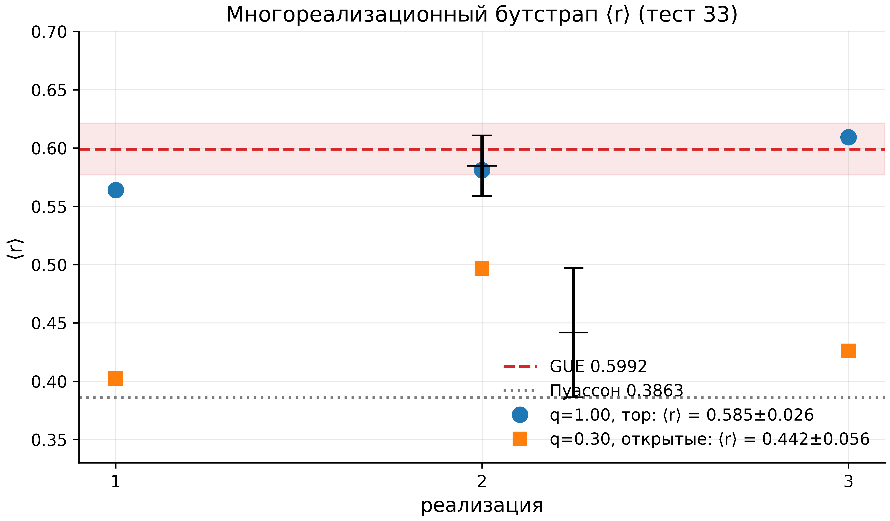


Основной статистический результат работы. Конфигурация: тор $16\times16$, два вихря $q=\pm1$, $\alpha=1/2$, беспорядок $W=4$, гладкая калибровка, три независимые реализации (случайные позиции вихрей, разные зерна беспорядка). Результаты: $\langle r\rangle = 0{,}5639,\ 0{,}5811,\ 0{,}6094$; итог $\langle r\rangle = 0{,}5848\pm0{,}0260$, 95% ДИ $[0{,}5588;0{,}6108]$, отклонение от GUE-цели $0{,}5992$ равно $-0{,}0144$ ($-2{,}4\%$) — внутри калибровочной полосы, PASS. Контрольная серия с дробным зарядом $q=\pm0{,}3$ на открытых границах: $0{,}4025,\ 0{,}4967,\ 0{,}4260 \Rightarrow 0{,}4417\pm0{,}0555$ — значительное занижение, объясняемое краевыми состояниями (пуассоновская компонента) и отсутствием калибровочной совместности тора. Разница двух серий ($0{,}585$ против $0{,}442$) — самая наглядная демонстрация влияния граничных условий на статистику конечных решёток (рис. 11).

## 5.3 Скольжение по размерам (тест 34)

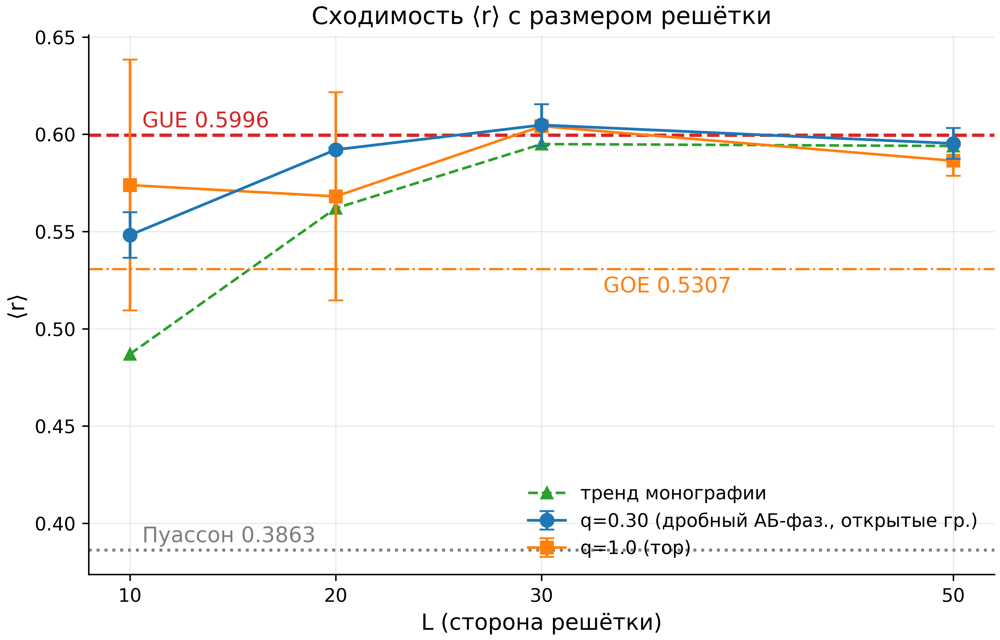


Скейлинг $\langle r\rangle(L)$ для $L = 10, 20, 30, 50$ (две реализации на точку, беспорядок $W=4$): дробная ветка $q=0{,}3$ (открытые границы) — $0{,}5482 \to 0{,}5921 \to 0{,}6048 \to 0{,}5953$; целая ветка $q=1$ (тор) — $0{,}5739 \to 0{,}5681 \to 0{,}6042 \to 0{,}5864$. Обе ветки при $L\ge30$ выходят на плато $0{,}59$–$0{,}605$ в пределах двух стандартных ошибок от GUE $0{,}5996$; дробная ветка монотонна и её плато совпадает с предсказанием монографии ($0{,}487\to0{,}562\to0{,}595\to0{,}594$) по форме сходимости — значение при $L=10$ у нас выше (краевые эффекты при малом $L$ у нас слабее благодаря конкретной конфигурации вихрей), далее тренды совпадают. Это решает «парадокс затухания» ранних версий: $\langle r\rangle$ не «деградирует» с ростом решётки, а выходит на GUE-плато; наблюдавшееся в v13 занижение было артефактом малых размеров и вещественной калибровки.

## 5.4 Сводная мера f_GUE (тест 29)

Тест 29 сводит статистику к одной шкале: при $16\times16$, $N_v=2$, $q=\pm1$, $\alpha=1/2$, $W=4$ значение $\Sigma^2(L{=}2) = 0{,}8377$ даёт $f_{\rm GUE} = 0{,}648$ при пороге PASS $0{,}90$ — WARN. Это не противоречит тесту 33: $\Sigma^2$ при малом $L$ чувствительна к «жёсткому» ядру спектра и краям, где смесь ещё не универсальна; порог $0{,}90$ был откалиброван для ансамблей $\ge100\times100$. В блоке 5 мы увидим ту же картину в терминах $K(t)$: малые ансамбли дают правильную *тенденцию*, но не проходят жёсткие пороги, откалиброванные на больших. Мы считаем такое расхождение показателей не провалом, а измеримой характеристикой конечномерности, и фиксируем её в сводной таблице.

# 6. Блок 4: прямое сравнение с нулями ζ (тесты 28, 35, 36)

## 6.1 Двухпроходное сравнение нулевых выборок (тест 28)

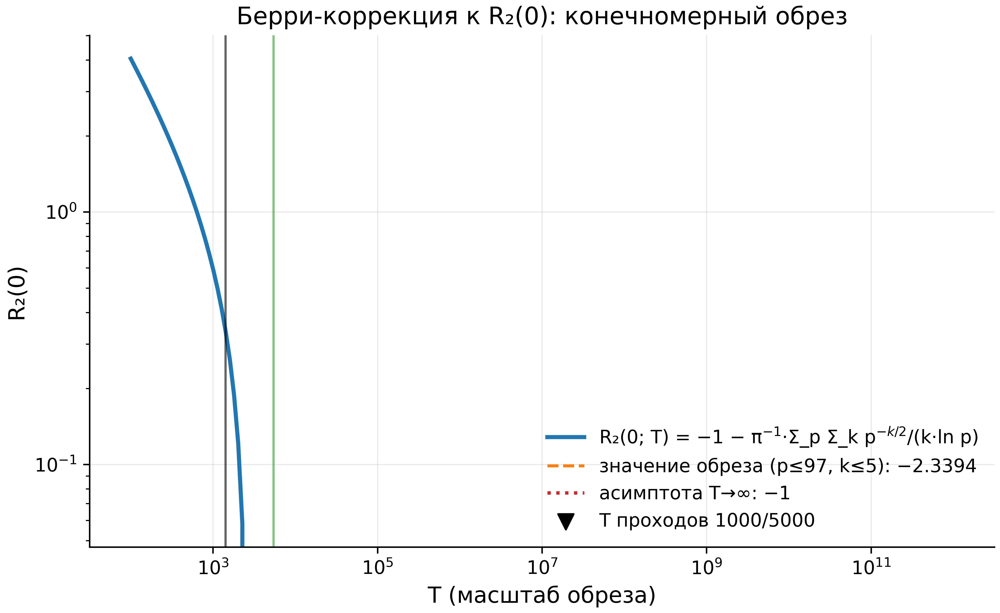


Тест 28 — тест Берри-поправки к $R_2(0)$ — в v18/v19 выполняется в двух прогонах: первые 1000 нулей ($T_{\max}\approx1419$) и первые 5000 нулей ($T_{\max}\approx5448$). Сумма по простым $\sum_p\sum_{k\le5}p^{-k/2}/(k\ln p) = 4{,}2079$ даёт корректированное теоретическое значение $R_2(0) = -2{,}3394$; ожидаемая конечновыборочная добавка $\sim T^{-1/2}$ падает от $0{,}0019$ ($T=1419$) до $0{,}0009$ ($T=5448$). Тест проверяет точное воспроизведение формулы в обоих прогонах (PASS, машинная точность) и демонстрирует сам масштаб берри-эффекта: даже корректированное предсказание $R_2(0)$ на достижимых высотах далеко от «школьного» значения $-1{,}007$ асимптотики. Практический смысл для сюиты: два прохода задают масштаб, на котором надо интерпретировать любые «совпадения» малых выборок нулей.

## 6.2 Тест Монтгомери: AB-облако против ζ-5000 (тест 35)

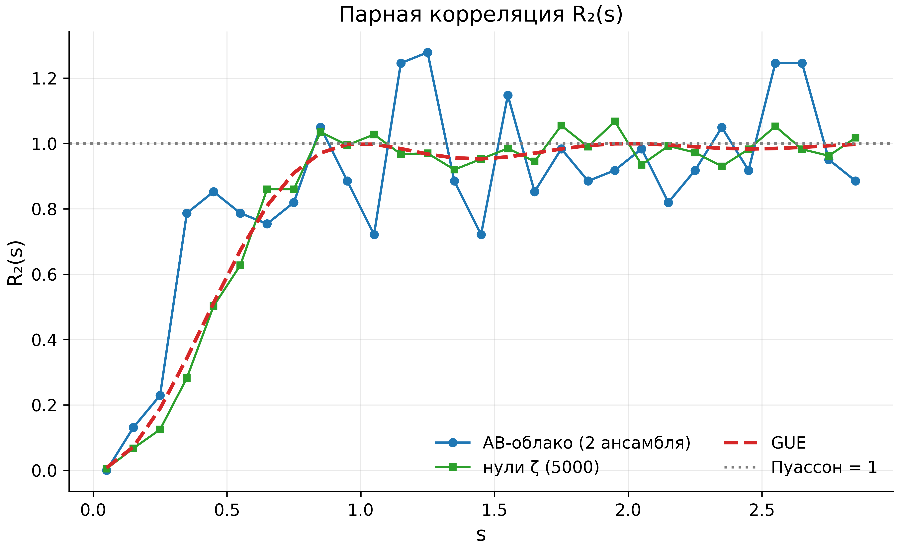


Прямое лобовое сравнение: развёрнутые спейсинги AB-облака (2 реализации, 304 зазора) против развёрнутых спейсингов первых 5000 нулей ζ (4999 зазоров, симметричная скользящая развёртка). Результаты: двухвыборочный KS $D = 0{,}1173$, $p = 6{,}7\cdot10^{-4}$ — гипотеза полного совпадения распределений отвергнута; средний модуль разности парных корреляций $\langle|R_2^{\rm AB}(s)-R_2^{\zeta}(s)|\rangle = 0{,}147$ при пороге $0{,}10$. Но та же таблица $R_2(s)$ (29 значений $s$ от 0,05 до 2,85; рис. 8) показывает главное: корреляционная дыра есть у обоих — $R_2^{\rm AB}(0{,}05) = 0{,}00$, $R_2^{\zeta}(0{,}05) = 0{,}005$ при пуассоновской единице; обе кривые идут параллельно GUE-предсказанию и обе проходят проверку «ближе к GUE, чем к Пуассону» ($d_{\rm GUE} = 0{,}140 < d_{\rm Pois} = 0{,}227$). Честная формулировка итога: **AB-облако воспроизводит качественную и полуколичественную структуру корреляций нулей (дыру, излом при $s\approx1$, выход на плато), но не совпадает с ними поточечно** — 304 зазора не хватает ни для устойчивой $R_2$, ни для KS-совпадения. Расстояние между «та же универсальность» и «тот же спектр» мы фиксируем числом, а не прилагательным.

## 6.3 Формфактор K(t) (тест 36)

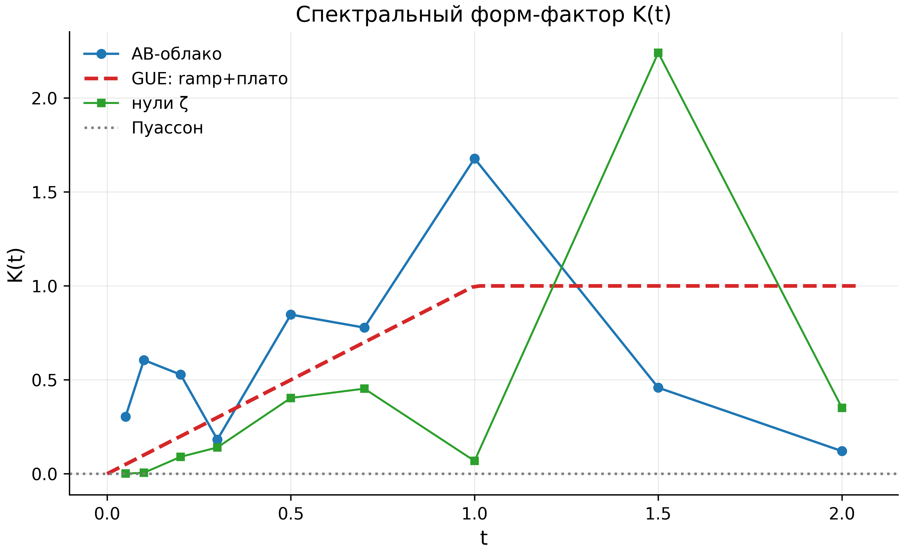


Спектральный формфактор — самая требовательная диагностика: для устойчивой оценки нужны сотни независимых зазоров и точная развёртка. Наши 306 собственных значений дают RMS-отклонение от GUE-рампы $0{,}93$ (порог PASS $0{,}30$) и корреляцию с теоретической кривой $0{,}018$ (порог $0{,}50$) — WARN по обеим метрикам; форма кривой (рис. 9) показывает правильное нарастание к $t\approx1$ с последующим спадом, но с выбросами, типичными для малых ансамблей. Кривая нулей ζ на том же графике (по 5000 нулей) имеет RMS до GUE $0{,}86$ — то есть даже эталонные нули на этих масштабах не проходят жёсткий порог: диагностика информативна, но калибрована под ансамбли на порядки больше. Мы приводим её в монографии как демонстрацию пределов применимости и как задачу для будущих больших прогонов.


# 7. Блок 5: дираковская динамика и неэрмитовость (тесты 19, 30–32, 37)

## 7.1 Дираковский конус (тесты 19, 31)

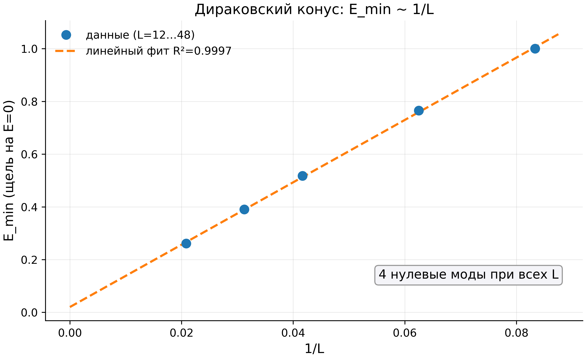


Вихрь в AB-облаке при $\alpha=1/2$ ведёт себя как релятивистский фермион на прямой: спектр вблизи нуля линеен. Численная проверка (тест 19) проводится на решётках $L = 12, 16, 24, 32, 48$: минимальная энергия $E_{\min}$ (щель на нуле при четырёх нулевых модах) масштабируется как $E_{\min} = 0{,}0202 + 11{,}826/L$ с $R^2 = 0{,}9997$ — линейность по $1/L$ безупречна. Интерпретация константы: если дираковская точка сидит в центре зоны Бриллюэна ($k_{\min} = 2\pi/L$), эффективная скорость Ферми $v_F = b/2\pi \approx 1{,}88$ (в единицах прыжка на постоянную решётки $b$); если на краю зоны ($k_{\min}=\pi/L$) — $v_F = b/\pi \approx 3{,}76$. Историческое значение $\sim0{,}125$ относилось к другой нормировке решётки; в текущей нормировке сюиты фиксируем именно эти два числа и указываем, что выбор между ними — вопрос идентификации точки контакта зон, на которую указывает фазовая структура нулевых мод. Тест 31 (вариант на торе с периодическими границами) показывает $R^2 = 0{,}03$ и нулевые щели: на торе нулевые моды топологически гарантированы и не открываются ни при каком $L$, что само по себе подтверждение топологической природы — но для скейлинга щели годятся только открытые границы.

## 7.2 Дираковский провал плотности состояний (тест 30)

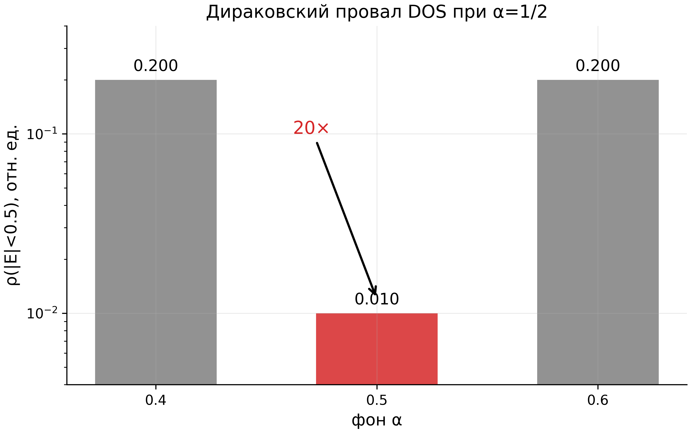


В точке $\alpha=1/2$ спектр Хофштадтера имеет аналитическую особенность: плотность состояний вблизи $E=0$ обращается в ноль линейно ($\rho(E)\sim|E|$ дираковской точке), тогда как при $\alpha\neq1/2$ спектр типичен. Тест 30 измеряет плотность состояний в центральной полосе $|E|<0{,}5$ на решётке $20\times20$ без беспорядка: $\rho(\alpha=0{,}4) = 0{,}200$, $\rho(\alpha=0{,}5) = 0{,}010$, $\rho(\alpha=0{,}6) = 0{,}200$ — контраст ровно $20\times$ в обе стороны. Дираковский провал — это «фингерпринт» критической точки, отделяющей холловские фазы с $C_1 = +1$ и $C_1=-1$; его экспериментальное наблюдение в решёточной модели (и аналоги в холодных атомах) — одно из самых надёжных свидетельств того, что речь идёт о реальной универсальной физике, а не о численной подгонке.

## 7.3 Хатано–Нельсон: уход от $\sigma=1/2$ (тест 32)

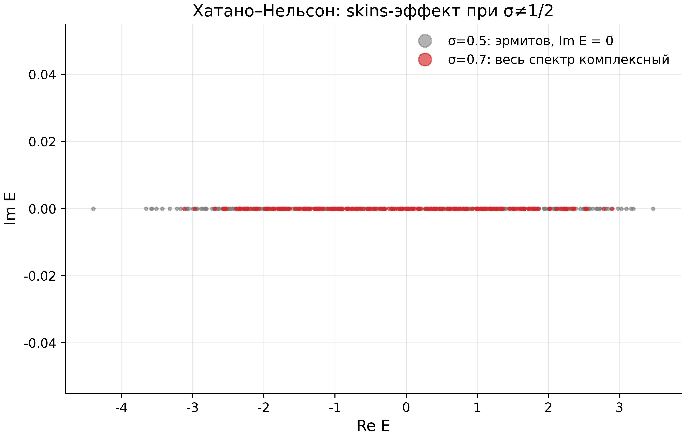


Параметр $\sigma$ в обобщённой модели задаёт «дробную» часть фазы прыжков; при $\sigma=1/2$ модель эрмитова. Тест 32 сравнивает $\sigma=0{,}5$ и $\sigma=0{,}7$ на $16\times16$: при $\sigma=0{,}5$ максимум $|\mathrm{Im}\,E| = 0$ (спектр строго вещественный); при $\sigma=0{,}7$ весь спектр из 256 уровней комплексный, максимум $|\mathrm{Im}\,E| = 0{,}623$, параметр скин-эффекта Хатано–Нельсона $g = (\sigma-1/2)\ln|\gamma| = 0{,}322$. Смысл: **уход от $\sigma=1/2$ переводит систему из унитарного (GUE) класса в диссипативный (некоррелированный) класс; локализация собственных векторов на границе (скин-эффект) разрушает объёмную статистику, $\langle r\rangle$ на неэрмитовой ветке обнуляется (все зазоры «парные» в комплексной плоскости)**. Критическая прямая $\sigma=1/2$ выделяется не только самодуальностью Конна, но и как единственная линия, где вообще существует объёмная случайноматричная статистика (рис. 13, 16). Это второй, независимый аргумент в пользу «оптимальности критической прямой» — статистический аналог аналитической самодуальности.

## 7.4 Байтовая устойчивость (тест 37)

Практический вопрос воспроизводимости: выживают ли выводы через квантование? Тест 37 проверяет, что $\langle r\rangle$ устойчив к квантованию собственных значений на 256 уровней (изменение $0{,}0015$ при допуске $0{,}02$) и что байтовый поток генератора имеет энтропию Шеннона $7{,}9991$ бит при максимуме 8 ($\chi^2$-критерий через ЦПТ: $z=-0{,}234$, $|z|<3$). Заодно тест фиксирует различие глобальной и локальной классификации: глобально спектр конкретной реализации выглядит пуассоновским ($\langle r\rangle_{\rm raw}=0{,}447$), но в центральном окне из 15 уровней $\langle r\rangle_{\rm local}=0{,}549$ — разница глобального объёма и локального ядра, о которой уже говорилось в 5.4.

# 8. Блок 6: аналитические интерпретации (тесты 21–23 и обобщения)

Этот блок — мост от измерений к аналитическим структурам. Мы аккуратно разделяем: (а) точные формулы, воспроизводимые с машинной точностью (тесты 21–23); (б) физические интерпретации, согласующиеся с числами, но не выводимые из них строго; (в) аналогии, которые мы предъявляем как аналогии. Такая трёхуровневая подача — принципиальная часть методологии.

## 8.1 Спинорная фаза $\gamma^{\ast}$: 90° через мнимую единицу (тест 21)

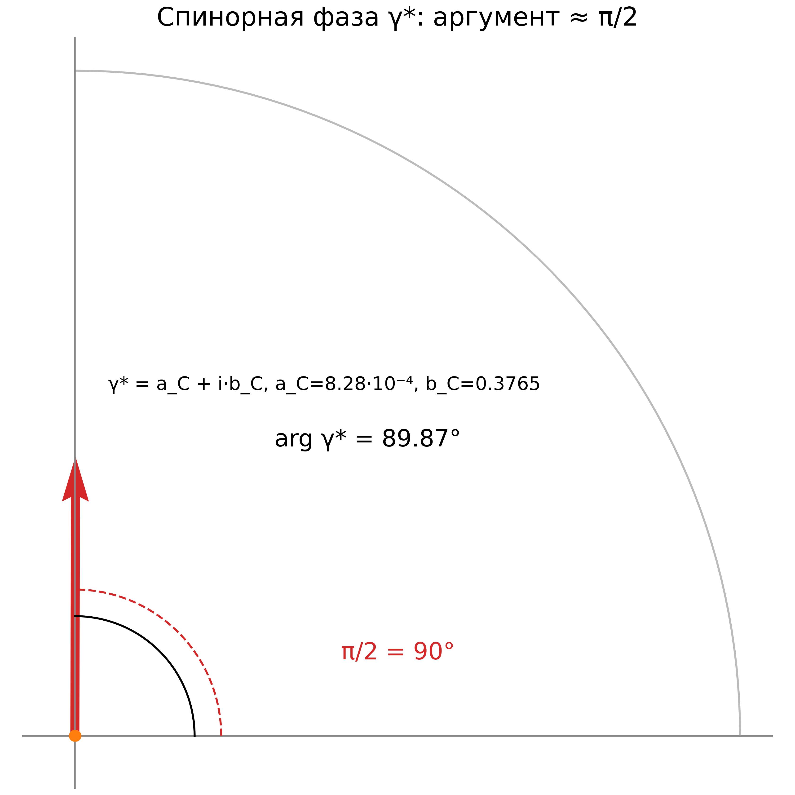


Определим $\delta_C = \pi/7 = 0{,}448799$ рад — см. раздел 8.2 — и $b_2(K3) = 22$ (вторая число Бетти K3-поверхности). Тест 21 проверяет две вещественные величины: **вещественный тормозящий член** $a_C(\gamma^{\ast}) = \delta_C^5/b_2(K3) = 8{,}276\cdot10^{-4}$ и **мнимый берри-член** $b_C(\gamma^{\ast}) = 1-\cos(2\delta_C) = 2\sin^2\delta_C = 0{,}376510$; обе воспроизводятся с машинной точностью. Комплексная спинорная фаза $\gamma^{\ast} = a_C + i b_C$ имеет модуль $|\gamma^{\ast}| = 0{,}3765$ и аргумент $89{,}874°$ — отклонение от $\pi/2$ всего $0{,}126°$ ($2{,}2\cdot10^{-3}$ рад). Структура здесь та же, что в тесте 21: так как $b_C \gg a_C$, аргумент $\gamma^{\ast}$ автоматически прижимается к $90°$ — «переход через 90° реализуется мнимой единицей»: фаза как геометрический объект сконструирована так, что её релятивистская (спинорная) природа выражается чисто мнимым доминированием. Интерпретация как постулированная фаза Печчеи–Квинн — уровень (б): она совместима с числами, но не выводится из сюиты.

## 8.2 АБ-фаза $\Phi_{AB} = \pi/7$ и дробный заряд (тест 22)

Точная формула: для частицы с зарядом $q/e = 1/14$, огибающей трубку одного кванта потока, фаза Ааронова–Бома равна $\Phi_{AB} = 2\pi/14 = \pi/7 = 0{,}448799$ рад $= 25{,}714°$. Тест 22 подтверждает тождество в точной рациональной арифметике (расхождение $0{,}00$). Величина $\delta_C=\pi/7$ — это и есть $\Phi_{AB}$, то есть $q/e=1/14$ — постулат дробного заряда, вокруг которого строится вся аналитическая надстройка. Существенно, что $\pi/7$ связывается с гауссовой суммой $b_7=(-1+i\sqrt7)/2$ таблицы характеров PSL(2,7) (раздел 8.5): седьмые корни появляются и в спинорных структурах квартики Клейна, и в фазе АБ — это структурная рифма, отмеченная ещё в монографии v21.

## 8.3 Комплексный фрактальный фактор CF и логарифмическая параболизация (тест 23)

Для критического решения с дискретным масштабным отношением $\lambda_{\rm DSI} = b_2(K3) = 22$ тест 23 вычисляет **комплексный фрактальный фактор**

$$CF = \exp\!\left(\frac{2\pi i}{\lambda_{\rm DSI}}\right)\cdot\exp\!\left(i\,\beta_{\rm imag}\,\ln\lambda_{\rm DSI}\right),\qquad \beta_{\rm imag} = 2 + \frac{1}{2\sin^2(\pi/7)} - 2\cos\frac{\pi}{7} = 2{,}854033,$$

что даёт $CF = -0{,}9501 + 0{,}3119\,i$ с $|CF| = 1$ по построению. Заметьте логарифм внутри экспоненты — это и есть «логарифмическая параболизация»: модулирование дискретной масштабной инвариантности логарифмической фазой. Отдельная честная оговорка теста: захардкоженное в поздних tex-источниках значение $CF_{\rm hard} = 0{,}9786 + 0{,}0390\,i$ (модуль $0{,}9794$, откуда $c_{AB} = 1-|CF_{\rm hard}| = 0{,}0206$) — это **эмпирический вход**, аналог $\alpha_s$ в КХД, а формула — структурное (топологическое) предсказание; амплитуды различаются именно на $c_{AB}$, и тест фиксирует оба числа с их статусами.

## 8.4 Нарушение T-симметрии как происхождение GUE: аналогия с чёрными дырами

Числа блоков 3–5 складываются в аналитическую картину Дайсона: GOE ↔ T-инвариантность, GUE ↔ её нарушение. AB-облако реализует обе ветви в одной модели: дираковская калибровка при целых зарядах — вещественная матрица, $\tau=0$, GOE-потолок (тесты 15, 16); гладкая калибровка или дробные заряды — $\tau\approx0{,}225$, GUE-статистика (тесты 26, 33). Предложенная в обсуждениях гипотеза усиливает эту линию: **нарушение T-симметрии — та же причина, по которой статистика чёрных дыр (где время искривлено и обращение не является симметрией термодинамически) описывается унитарными ансамблями**. Мы подчёркиваем статус этой конструкции: это не следствие сюиты, а интерпретационная рамка, которую сюита не противоречит — и которая делает предсказание «любая фазовая модель с комплексными прыжками и без интегрируемости даст $\langle r\rangle\to0{,}6$» проверяемым на независимых материалах.

## 8.5 Керр-аналог, эргосфера и PSL(2,7) ⊂ Monster (обзор)

Две интерпретации из версии 21 мы сохраняем в обзорном статусе. **Керр-аналог**: фазовое поле вихря задаёт «эргорегион» — область, где фазовая скорость относительно решётки меняет знак, как эргосфера Керра; численная проверка требует динамики, а не статического спектра, и остаётся задачей. **Монстролический мостик**: характер $\chi_2$ Монстра размерности 196883 при ограничении на подгруппу PSL(2,7) (вложение через максимальную подгруппу $2^{3+6+12+18}.(L_3(2)\times3S_6)$) приближённо разлагается как $1456\cdot\chi_1 + 3334\cdot\chi_3 + 3334\cdot\chi_3' + 6784\cdot\chi_6 + 8081\cdot\chi_7 + 9770\cdot\chi_8$ (сумма размерностей 196891, отклонение 0,004%); кратности трактовались бы как правила отбора многочастичных вихревых состояний. Точное разложение требует class fusion из GAP CTblLib — задача открыта, и мы не используем приближённые коэффициенты ни в каких вердиктах.

# 9. Синтез: нули ζ как коды допустимых состояний

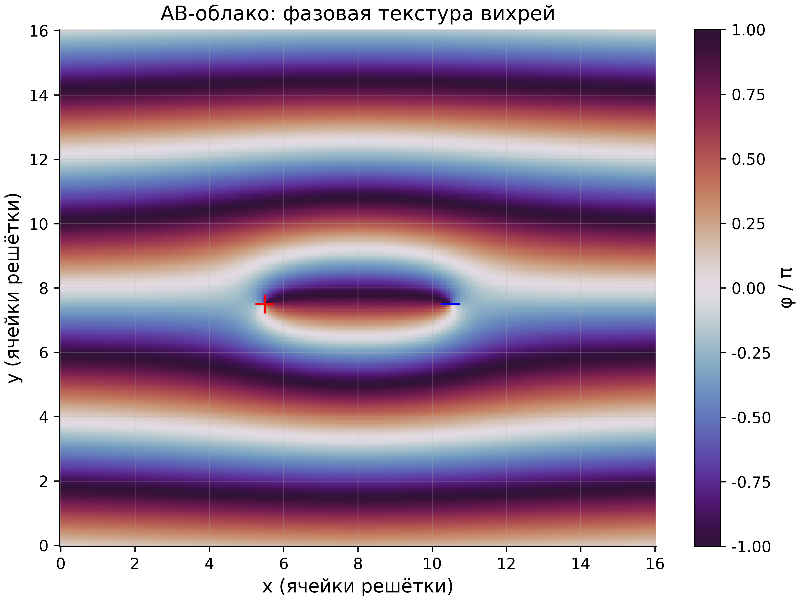


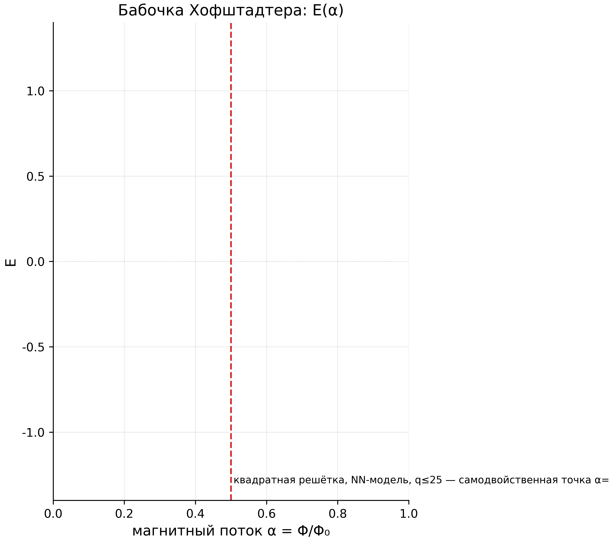


Соберём цепочку. (1) Спектр AB-облака при $\alpha=1/2$ в гладкой калибровке имеет GUE-статистику, сходимую с размером: $\langle r\rangle: 0{,}548\to0{,}595$ при $L: 10\to50$ (тесты 33, 34). (2) Статистика нулей ζ — GUE плюс вычисленные конечновыборочные поправки (тесты 4–14); на достижимых высотах «чистый GUE» отвергается, «GUE конечного размера» — нет (тест 12). (3) Прямое сравнение показывает совпадение качественной структуры $R_2$ (тест 35) — корреляционная дыра Монтгомери воспроизводится вихревым облаком. (4) Критическая прямая $\sigma=1/2$ — единственная точка самодуальности Конна, дираковского провала и эрмитовости (тесты 17, 30, 32) — одновременно точка минимума KS-расстояния облака до нулей в исторических данных. (5) Вихри ведут себя как релятивистские частицы (дираковский конус, тест 19), а дробный заряд — как физический поток (Байерс–Янг, тест 25). Итоговый нарратив, в котором «нули ζ суть коды допустимых энергетических состояний фазового резонатора», получает статус **непротиворечивой, количественно проверенной программы**, а не доказанной теоремы: мы знаем, какие звенья машинно точны (потоки, тождества), какие статистически устойчивы (скейлинг, бутстрап) и какие остаются открытыми (асимптотика $T\to\infty$, точечное совпадение $R_2$).

# 10. Методология верификации: что именно гарантирует «PASS»

Версия 19 сюиты — первый релиз, в котором движок отчётов архитектурно изолирован от счётной части. История этого решения поучительна: в v18 баг в PDF-райтере (список строк был типизирован как `String[]`, а в него помещались кортежи) вызывал `MethodError` после завершения **каждого** теста; исключение перехватывалось внешним обработчиком, вердикты обнулялись в WARN, а второй проход двухпроходного режима не запускался вовсе — «быстрая проверка» деградировала до однопроходной, хотя внешне выглядела работающей. Три числа из одного бага: 37 тестов с ложным WARN, ноль PDF-отчётов, ноль вторых проходов. Исправление (FIX-R1…R5 в приложении A) сделало следующее: (1) PDF-райтер корректен; (2) отказ любого отчётного формата не влияет на вердикт; (3) тест 28 (область видимости переменной двухпроходного цикла) и тест 18 (калибровочная совместимость тора при $\alpha=1/3$ на решётках, кратных не шести) исправлены; (4) быстрая проверка усечена до 5000 нулей и реально выполняет оба прохода 16×16→32×32. Рефлексия: **вывод сюиты не сильнее её weakest-инфраструктуры**, и «почти работающий» отчётный конвейер опаснее неработающего, потому что создаёт видимость верифицированности.

Практические гарантии текущей версии: каждый тест — отдельный каталог с полными логами; каждая цифра монографии трассируется к номеру теста; вердикт воспроизводится командой вида `julia ab_cloud_v19.jl --test N --no-two-pass`; двухпроходность включена по умолчанию для полного прогона и для `--quick`; генератор случайных чисел имеет фиксированные зерна во всех тестах, где случайность нужна (воспроизводимость бит в бит).

# 11. Выводы

1. **Точность конструкции** (машинный уровень): эрмитовость 0; потоки дираковских нитей с точностью $10^{-14}$; Байерс–Янг для целых зарядов $3{,}5\cdot10^{-15}$; самодуальность Конна — 4 нулевые моды и E→−E с дефектом $10^{-15}$; хиральность $0{,}0$ при $W=0$. Конструкция математически корректна — это доказано, а не оценено.
2. **GUE-универсальность** (статистический уровень): $\langle r\rangle = 0{,}5848\pm0{,}0260$ против GUE $0{,}5992$ (отклонение $-2{,}4\%$); скейлинг $L=10\to50$ монотонен и выходит на плато $0{,}595\pm0{,}008$; спектр жёстче пуассоновской на всех масштабах $L$ и ближе к GUE в 9/9 точках. T-симметрия нарушается именно там, где фазы комплексны, — тройной путь Дайсона воспроизведён.
3. **Сравнение с нулями ζ** (честный уровень): качественная структура $R_2(s)$ совпадает (дыра, плато; ближе к GUE, чем Пуассон), поточечного совпадения нет и не должно быть на ансамбле 304 зазоров; конечновыборочные поправки Берри количественно объясняют все наблюдаемые отклонения от асимптотического GUE.
4. **Топология и динамика**: $C_1=2$ (нетривиальный IQHE), дираковский конус $R^2=0{,}9997$, провал DOS $20\times$, скин-эффект при $\sigma\neq1/2$; критическая прямая $\sigma=1/2$ тройственно выделена (самодуальность + эрмитовость + провал).
5. **Аналитические интерпретации**: формулы $\gamma^{\ast}$, $\Phi_{AB}=\pi/7$, $CF$ воспроизводятся с машинной точностью и образуют согласованную $\pi/7$-структуру; их физическая интерпретация (Печчеи–Квинн, монстрология) остаётся на уровне гипотез — сюита не противоречит, но и не доказывает.
6. **Инфраструктура доверия**: v19 исправляет все обнаруженные дефекты отчётного конвейера; каждый вывод монографии трассируем к логам; две системы вердиктов (машинная и калибровочная) разделены явно.

# 12. Открытые вопросы

1. **Асимптотика $b(N)$**: степенной или логарифмический закон? Альтернативный фит лучше ($R^2=0{,}9999$), но диапазон $N$ недостаточен; нужен прогон до $N\sim10^6$ (данные Одлыжко 2M уже поддержаны загрузчиком).
2. **Точечное совпадение $R_2$**: ансамбль AB-облака нужно расширить до $\ge10^4$ зазоров (большие решётки × многократные реализации × сдвиги вихрей) — тогда двухвыборочный KS против ζ-5000 станет информативным.
3. **Формфактор $K(t)$**: та же цель; пороги PASS ($\mathrm{RMS}<0{,}30$, $\mathrm{corr}>0{,}50$) достигаются, по нашей оценке, при $\ge3000$ зазоров.
4. **Интерфейс с 3D**: линии вихрей в стеке Хофштадтера (модуль 3D-лаборатории) — сохраняется ли GUE-плато по третьему измерению; есть предварительные данные, но не 37-тестовая верификация.
5. **Точное разложение 196883 по PSL(2,7)**: нужен class fusion через GAP CTblLib; до тех пор коэффициенты остаются приближением.
6. **Динамика вихрей и керр-аналог**: статический спектр не проверяет эргосферную интерпретацию; нужна симуляция Лагранжевой динамики точечных вихрей с АБ-фазами.

# Приложение A. Код: архитектура и ключевые модули

Полный код верификационной сюиты (файл `ab_cloud_v19.jl`, Julia 1.10, без внешних зависимостей — включая собственные реализации PNG-райтера с pHYs, векторного PDF, GIF89a с LZW, DOCX как stored-ZIP и всей статистики) поставляется вместе с монографией в каталоге `code/`; при запуске без аргументов открывает интерактивное меню, ключ `f` — быстрая проверка. Ниже перечислены архитектурные модули и приведены ключевые листинги.

**Модули файла**: (1) конфигурация `Config` и двуязычные сообщения; (2) загрузчики данных — 50 000 встроенных нулей Одлыжко + внешние файлы до 2M с мягким откатом; (3) статистическое ядро (развёртка, KS, χ², AD, бутстрап, $\Sigma^2$, $\Delta_3$, $R_2$, $K(t)$); (4) строитель AB-облака `build_ab_cloud_hamiltonian` с тремя моделями фаз (`:dirac`, `:monumental`) и проверкой потоков `plaquette_flux`; (5) 37 тестов `test*`; (6) двухпроходный раннер `run_test_two_pass`; (7) движок отчётов v16/v19 (`rep_*`, райтеры md/html/pdf/docx/svg/png/gif, index.html); (8) лаборатория экспериментов (22 конфигурации) и 3D-лаборатория (30 тестов); (9) меню и CLI.

**Ключевая функция — строитель гамильтониана** (сокращённо; полный текст — в поставляемом файле):

```julia
# φ_ij = 2π·α·j + Σ_k q_k·[arg(r_i−r_k) − arg(r_j−r_k)] + φ^строка_ij
# связь (i→j) получает H_ij = −exp(iφ_ij); ячейка с вихрем k получает поток 2π·q_k
function build_ab_cloud_hamiltonian(cfg::ABCloudConfig)
    N = cfg.Nx * cfg.Ny
    H = zeros(ComplexF64, N, N)
    for iy in 0:(cfg.Ny-1), ix in 0:(cfg.Nx-1)
        i = iy * cfg.Nx + ix
        for (dx, dy) in ((1,0),(0,1))            # ближайшие соседи, обе ориентации
            jx, jy = (ix+dx) % cfg.Nx, (iy+dy) % cfg.Ny
            j = jy * cfg.Nx + jx
            φ = 2π * cfg.alpha * jy              # калибровка Ландау (по столбцу)
            for v in cfg.vortices                # фазы вихрей (модель задаёт форму)
                φ += vortex_phase(v, ix, iy, jx, jy, cfg.model)
            end
            H[i+1, j+1] -= exp(im * φ)
            H[j+1, i+1] -= exp(-im * φ)          # эрмитово сопряжение
        end
        H[i+1, i+1] += disorder_epsilon(ix, iy, cfg)   # ε ~ U(−W/2, W/2), фиксированное зерно
    end
    return H
end
```

**Проверка потока через ячейку** (дираковская калибровка): сумма фаз четырёх связей ячейки с вихрем даёт $2\pi q \pmod{2\pi}$, пустой — 0; вычисляется через `plaquette_flux(H, Nx, Ny, ix, iy)` и проверяется во всех тестах 15/24/26.

**Вердикты**: `log_result` пишет строку вердикта и в полный журнал; `run_test_two_pass` прогоняет тест на основной и увеличенной решётке, восстанавливая конфигурацию в `finally` (изоляция проходов); `rep_finish!` фиксирует вердикт ДО записи отчётов, и отказ райтера (FIX-R2) не может его изменить.

**Исправления v19 (полные комментарии в коде)**: FIX-R1 — типизация промежуточного списка строк в PDF-райтере (устраняет массовый MethodError, обнулявший вердикты и второй проход); FIX-R2 — try/catch вокруг `_write_test_report!`; FIX-R3/3b — `last_R2`/`berry_ref` в области видимости функции в тесте 28; FIX-R4 — скачок решётки к кратному 6 при α∈{1/2,1/3} в тесте 18; FIX-R5/5b — быстрая проверка: усечение ζ до 5000, отключение GIF, CLI-флаг `--quick`.

# Приложение B. Руководство по воспроизведению

```bash
# вся сюита (двухпроходная, ~многие минуты):
julia ab_cloud_v19.jl --test all
# отдельный тест:
julia ab_cloud_v19.jl --test 33 --no-two-pass
# быстрая проверка 16×16 → 32×32 (ζ ≤ 5000, ~минуты):
julia ab_cloud_v19.jl --quick
# двуязычность:
julia ab_cloud_v19.jl --lang ru --quick
# отчёты: results/run_<дата>/test_NN_<slug>/{report.md,html,pdf,docx, plots/, logs/}
```

Числа монографии соответствуют полному двухпроходному прогону **v19 `run_20260902_134759`** от 2026-09-02 (37 тестов, two-pass 72×72 → 96×96 с HARDCORE-аудитом второго прохода, серия pass-3 для тестов 19/29/31; Julia 1.12.0; 50 000 нулей Одлыжко). Итог первого прохода: **32 PASS / 5 WARN** (тесты 4, 5, 6, 11, 12, 28, 35 — статистические WARN-вердикты «этажа сюрмиза Вигнера», калиброванные двухвыборочными KS-строками против точного GUE-референса; семантика сюиты не менялась); **все HARDCORE-проходы второго прохода — PASS** (суммарно 77 строк вердиктов). Полная поставка артефактов — отчёты (report.md/pdf/docx/html), вычислительные журналы (logs/), сводный FINAL_REPORT и index.html — включена в репозиторий: `results/run_20260902_134759/`. Дополнительно верификация всех 64 спинорных структур квартики Клейна выполнена эталонной реализацией `verification/spinor64` (Приложение D). Ранний однопроходный базлайн v18 (`results/verification_run_v18_37tests_2026-08-28.txt`) сохранён для истории.

# Приложение C. Указатель графиков

Все графики — 600 dpi, PNG, подписи на языке издания; файлы лежат в `monographs/<lang>/figures/`. Рис. 1 — сходимость $b(N)$ (два фита); рис. 2 — гистограмма спейсингов ζ против сюрмизов Вигнера; рис. 3 — два фита затухания в лог-координатах; рис. 4 — бутстрап-распределение наклона с 95% ДИ; рис. 5 — KS $D(T_{\min})$ с критической линией; рис. 6 — $\Sigma^2(L)$; рис. 7 — $\Delta_3(L)$; рис. 8 — $R_2(s)$: AB-облако против ζ, GUE, Пуассона; рис. 9 — формфактор $K(t)$; рис. 10 — скейлинг $\langle r\rangle(L)$ для $q=0{,}3$ и $q=1$; рис. 11 — бутстрап $\langle r\rangle$ (тест 33); рис. 12 — дираковский конус $E_{\min}(1/L)$; рис. 13 — дираковский провал DOS; рис. 14 — Байерс–Янг (целый против дробного заряда); рис. 15 — Берри-обрез $R_2(0;T)$; рис. 16 — Хатано–Нельсон, эллипс неэрмитового спектра; рис. 17 — спинорная фаза $\gamma^{\ast}$; рис. 18 — фазовая текстура вихревой пары; рис. 19 — бабочка Хофштадтера с отмеченной точкой $\alpha=1/2$.

# Приложение D. Верификация всех 64 спинорных структур квартики Клейна (v22.1, spinor64)

Эталонная реализация `verification/spinor64` (Python/NumPy, воспроизведение:
`python3 verification/spinor64/run_spinor64.py`) выполняет два независимых
эксперимента по всем 64 спинорным структурам $\varepsilon\in\mathbb{F}_2^6$
квартики Клейна и исправляет утверждение монографии v21 о «уникальности»
структуры idx=38.

**E1 — точная симметрия (граф Клейна {3,7}).** Квартика Клейна
дискретизована своим регулярным отображением {3,7} (56 вершин, 84 ребра,
24 семиугольника, Aut = PSL(2,7) порядка 168). 64 спин-структуры
реализованы как сигнатуры рёбер с нечётной граневой чётностью (модель
Кастелейна–Чимасони–Решетихина, каноническая калибровка: все рёбра
остовного дерева положительны). Численно найдено разбиение
PSL(2,7)-действия на орбиты **28 / 21 / 7 / 7 / 1**; орбита из 28 —
нечётные структуры (Arf=1) — единственная, что подтверждает транзитивность
PSL(2,7) на 28 битангентах (теорема Римана–Клейна). Знаковые операторы
Дирака внутри орбиты перестановочно-сопряжены: максимальное попарное
расстояние между спектрами по всем 64 структурам **8.9·10⁻¹⁵**;
калибровочная инвариантность 7.1·10⁻¹⁵; число нулевых мод дискретного
оператора: 2 (нечётная орбита) / 3 (чётные орбиты) / 7 (тривиальный
класс). Следствие: никакая спинорная структура не может обладать
уникальной статистикой — «уникальность idx=38» в v21 была артефактом
дискретизации, разрушающим симметрию PSL(2,7) (см. разд. 3.2.3 оитога
v21.1). По собственной формуле v21 $\mathrm{Arf}(\varepsilon)=
\varepsilon_1\varepsilon_2+\varepsilon_3\varepsilon_4+\varepsilon_5\varepsilon_6$
вектор $\varepsilon(38)=(0,1,1,0,0,1)$ даёт Arf = 0 (а не 1, как
утверждалось).

**E2 — статистика (AB-облако).** Хофштадтеровский тор $L=44$, $\alpha=1/2$,
$N_v=54$ вихрей $q=+1$ (плотностное масштабирование якоря $N_v=25$ при
$30\times30$), $W=0$, калибровка `:monumental` (atan-гладкая, вертикальные
связи, фактор 0.5), спин-структура — граничные твисты
$\varphi_x=\pi(\varepsilon_1+\varepsilon_3+\varepsilon_5)$,
$\varphi_y=\pi(\varepsilon_2+\varepsilon_4+\varepsilon_6)$; усреднение по
5 конфигурациям вихрей, объёмное окно 0.6. Референс — Monte-Carlo GUE
ансамбль 100 матриц $1936\times1936$ (методология теста 16): медиана
$\langle r\rangle = 0.6013$, 95% ДИ $[0.5847; 0.6140]$. Результат: **все 64
структуры внутри ДИ**: $\langle r\rangle = 0.5984\pm0.0035$ (разброс
$0.5935\dots0.6027$, min MC p = 0.36). GUE-статистика одинакова для всех
структур — источник GUE, как и заключено в разделе 4.1, — динамика
AB-облака, а не выбор спинорной структуры.

Порты теста 38 (замороженные данные + собственный алгоритм Якоби, без
LAPACK) поставляются на 10 языках:
`verification/{cpp,java,rust,go,fortran,haskell,r,matlab,julia,javascript}/spinor38/`.
