# Abstract

This monograph has been written from scratch and summarizes a systematic numerical study of the object we call the **AB-cloud**: a lattice quantum system (a Hofstadter Hamiltonian with Aharonov–Bohm phases) in which topological vortex excitations generate an inhomogeneous phase texture, and the distribution of eigenvalues is compared against the statistics of the zeros of the Riemann zeta function. Every claim made here is accompanied by reproducible numbers from an automated 37-test verification suite (versions 18/19, August 2026). Every number carries its test ID; every test produces a full computation log; every suite run leaves on disk a directory with reports in four formats (Markdown, HTML, PDF, DOCX), figures in three raster/vector formats, and timestamped logs designed for independent verification.

The principal verified results are as follows. First, in the smooth gauge (the `:monumental` vortex phase model), the mean ratio of adjacent level spacings of the AB-cloud spectrum on a torus reaches $\langle r\rangle = 0.585 \pm 0.026$ against the GUE target $0.5992$ — a $-2.4\%$ deviation (Test 33) — and a scan over lattice sizes $L = 10, 20, 30, 50$ shows monotone convergence $0.548 \to 0.592 \to 0.605 \to 0.595$ (Test 34). Second, a direct comparison of unfolded AB-cloud spacings with the first 5000 ζ zeros shows that the cloud's pair correlation function is closer to GUE than to Poisson across the entire interval $s\in[0;3]$, although the two-sample Kolmogorov–Smirnov test on so small an ensemble rejects exact distributional equality ($p = 6.7\cdot10^{-4}$; Test 35) — we record this discrepancy honestly and explain it by ensemble finiteness. Third, the topological skeleton of the construction is confirmed at machine precision: the Dirac-string gauge yields flux $2\pi q$ through exactly one plaquette (Tests 15, 24); the Byers–Yang theorem holds to $3.5\cdot10^{-15}$ for integer charge and is violated by $0.34$ for fractional charge (Test 25); the Chern number of the lowest band is $C_1 = 2$ (Test 20); and Connes self-duality at $\alpha = 1/2$ produces exactly 4 zero modes (Test 17). Finally, the low-energy dynamics exhibits a Dirac cone with linear gap scaling $E_{\min}\propto 1/L$, $R^2 = 0.9997$ (Test 19), a Dirac dip in the density of states with contrast $20\times$ at $\alpha = 1/2$ (Test 30), and the Hatano–Nelson skin effect away from the Hermitian point $\sigma = 1/2$ (Test 32).

Together these results form a coherent narrative: the AB-cloud is a phase resonator in which universal GUE statistics arise from time-reversal violation by complex hopping phases, vortices behave as relativistic particles, and the critical line $\sigma = 1/2$ stands out as the self-dual point where the cloud's statistics come closest to those of the ζ zeros. We consistently separate the proven (machine precision), the reliably measured (calibrated statistical bands), and the still open (the large-$T$ asymptotics), supplying every conclusion with an explicit criterion — the reader is never asked to take a number on faith.

**Keywords:** Hilbert–Pólya conjecture; Riemann zeta function; random matrix theory; GUE; Aharonov–Bohm effect; Hofstadter Hamiltonian; AB-cloud; topological vortices; Dirac cone; TKNN; Hatano–Nelson skin effect.

# 1. Introduction and Problem Statement

## 1.1 The Hilbert–Pólya Conjecture

In 1914 Riemann conjectured that all non-trivial zeros of the zeta function $\zeta(s)$ lie on the critical line $\mathrm{Re}\,s = 1/2$. Nearly half a century later, in 1958, David Hilbert (as recalled by Pólya) proposed the strategy now known as the **Hilbert–Pólya conjecture**: if one can find a self-adjoint operator $\hat H$ whose spectrum coincides with the zero ordinates $\{\gamma_n\}$, then the Riemann Hypothesis would follow immediately — Hermiticity forces all eigenvalues to be real, i.e. $\mathrm{Re}\,\gamma_n = 1/2$ for every $n$. The beauty of this program is that it translates analytic number theory into quantum mechanics: the zeta zeros become energy levels of some (as yet unknown) physical system.

The conjecture remains unproven, but it frames the present work: we construct and study a concrete class of quantum lattice systems whose spectral statistics approach universal random-matrix behavior. We emphasize the methodological position that distinguishes this monograph from much prior literature on the subject: we **do not claim a proof of the Riemann Hypothesis**. Our object is a precise numerical characterization of how closely finite lattice ensembles approach universal random-matrix statistics, and which parameters bring that convergence closer or push it away. All "closeness" criteria were fixed in advance, before the tests were run, and were never tuned along the way.

The historical context, briefly: in 1972 Montgomery formulated his pair-correlation conjecture for ζ zeros; Dyson, upon casually meeting Montgomery in the tea room of the Princeton Institute for Advanced Study, pointed out that Montgomery's formula coincides with the pair correlation of eigenvalues of the GUE (Gaussian Unitary Ensemble) of random matrix theory. In the 1980s Odlyzko confirmed the coincidence numerically on an enormous dataset, and Berry in 1985 computed the finite-size corrections: a real (finite-$T$) sample of zeros must deviate from the pure GUE prediction in a predictable way — in particular, the pair correlation at the origin $R_2(0)$ receives a correction that decays as a power of $T$. These corrections are crucial for us: they explain why our Tests 4–6 and 11 see statistically significant deviations from GUE on samples with $T \lesssim 4\cdot10^4$, and why such deviations confirm rather than refute the picture.

## 1.2 The Aharonov–Bohm Effect and the AB-Cloud

The **Aharonov–Bohm (AB) effect** is the observation that a quantum particle responds to magnetic flux even where the field strength vanishes: a wave function encircling a solenoid carrying flux $\Phi$ acquires the phase $\varphi_{\rm AB} = 2\pi\Phi/\Phi_0$, where $\Phi_0 = h/e$ is the flux quantum. On a lattice this is encoded by dressing the hopping amplitudes: $t_{ij}\to t_{ij}e^{i\varphi_{ij}}$. The **Hofstadter Hamiltonian** is the canonical instance: electrons on a square lattice in a uniform magnetic field with flux $\alpha = \Phi/\Phi_0$ per plaquette; its spectrum as a function of $\alpha$ is the famous Hofstadter butterfly (reproduced as Fig. 19 of our figure set).

By the **AB-cloud** we mean the generalization in which pointlike **topological vortices** are placed on the lattice — centers around which the hopping phase winds by $2\pi q$ ($q$ is the vortex charge, which may be fractional). The phase field of such a system is inhomogeneous: near each vortex the phase curls, and the combined picture resembles a cloud — hence the name. Mathematically the Hamiltonian is

$$H_{ij} = -\exp\bigl(i\varphi_{ij}\bigr),\qquad \varphi_{ij} = 2\pi\alpha\,j + \sum_{k=1}^{N_v} q_k\bigl[\arg(\mathbf r_i - \mathbf r_k) - \arg(\mathbf r_j - \mathbf r_k)\bigr] + \varphi^{\rm str}_{ij},$$

where $j$ is the lattice column index (Landau gauge), $N_v$ the number of vortices, and $\varphi^{\rm str}_{ij}$ the explicit **Dirac string**: an addition of $-2\pi q$ attached to every bond crossing the half-line (string) emanating from the vortex. The Dirac string guarantees that the total magnetic flux around the vortex equals exactly $2\pi q$ to machine precision — verified by direct computation (Tests 15, 24).

Beyond the geometric (phase) part, the model carries **on-site disorder** $W$: additive node noise modeling impurities in a real crystal. Model parameters: lattice size $L\times L$, flux $\alpha$, charge set $\{q_k\}$, vortex number and positions $N_v$, disorder strength $W$, and boundary conditions (open or torus). A key physical switch is the **vortex phase model**: (a) the Dirac-string gauge, in which integer-charge vortices are spectrally invisible (an exact Byers–Yang theorem, Test 25), and (b) the smooth `:monumental` gauge (an atan model), in which phases are spread smoothly and are complex for any $q$ — this is what makes GUE statistics reachable at physically sensible parameters. Both gauges are implemented in the code and used as appropriate: flux theorems are verified in the first, spectral statistics in the second.

## 1.3 Connection to Random Matrix Theory

**Random matrix theory (RMT)** studies eigenvalue distributions of large matrices with random entries. Three ensembles matter for us, distinguished by time-reversal symmetry: **GOE** (real symmetric, T-symmetric), **GUE** (complex Hermitian, T-violating), and **GSE** (quaternionic self-dual), plus the limiting **Poisson** case (uncorrelated levels; integrable systems). The diagnostics are defined in Section 2.2; here we note the central scale of the mean adjacent-gap ratio: $\langle r\rangle \approx 0.386$ (Poisson), $0.531$ (GOE), $0.600$ (GUE). Dyson's threefold way predicts that T-violation by complex phases necessarily moves a system into the GUE class — and the AB-cloud in the smooth gauge is a textbook illustration: at $\alpha = 1/2$ the matrix is complex Hermitian with $\tau(H) = \|H-H^*\|/\|H\| = 0.225 \neq 0$ (Test 26), and the statistics indeed approach GUE, whereas in the real Dirac-string gauge $\tau = 0$ and the spectrum is locked into the GOE class (Tests 15, 16).

## 1.4 Goals, Tasks, and Verification Organization

The goal of this work is a complete, independently checkable picture of AB-cloud spectral physics. The tasks are concretized as 37 automated tests grouped into six blocks: (1) convergence of the $b(N)$ correction and the reviewers' objections (Tests 1–14); (2) construction and topological theorems (15, 17, 20, 24–27); (3) GUE classification of the cloud (16, 26, 29, 33, 34); (4) direct comparison with ζ zeros (28, 35, 36); (5) Dirac dynamics and non-Hermiticity (19, 30–32, 37); (6) analytical interpretations (Tests 21–23 and Section 8). Each test returns a boolean verdict against a pre-registered criterion; verification is two-pass (first pass — the primary lattice, second — an enlarged one), and the "quick check" runs all 37 tests on $16\times16\to32\times32$ lattices with a ζ sample truncated to 5000 zeros in minutes.

We explicitly distinguish the **two verdict systems** so the reader never confuses them. Formulaic tests (identities: fluxes, self-duality, Byers–Yang) are checked with machine tolerances $10^{-12}\dots10^{-16}$ and yield a binary PASS/FAIL. Statistical tests (GUE agreement) are calibrated against confidence bands established by simulation: e.g., PASS on $\langle r\rangle$ requires the band $0.5992\pm0.022$; these admit a third verdict, WARN — "a deviation was measured but is explained by finite size". This dual system removes the cardinal sin of numerical work — tuning the criteria to the result.

# 2. Mathematical Background

## 2.1 The Riemann Zeta Function and Its Zeros

The **Riemann zeta function** $\zeta(s) = \sum_{n\ge1} n^{-s}$ extends analytically to the whole complex plane and has non-trivial zeros in the critical strip $0<\mathrm{Re}\,s<1$. Numerically we use the first 50,000 zeros (Odlyzko's dataset), whose ordinates fill $T\in[14.13;\,40433.7]$. The density of zeros at height $T$ is given by the **Riemann–von Mangoldt formula**:

$$N(T) = \frac{T}{2\pi}\ln\frac{T}{2\pi} - \frac{T}{2\pi} + \frac{7}{8} + O(\ln T),$$

which grows roughly as $(T/2\pi)\ln T$. Dividing out the local density — the **unfolding** procedure — makes the normalized spacings $\delta_n = \gamma_{n+1}^{(u)} - \gamma_n^{(u)}$ have unit mean by construction, so all correlation information is carried by their distribution. In the code, unfolding uses a symmetric sliding window over the smooth $N(T)$; this standard step is also where artifacts most often creep in, which is why Test 10 checks the stability of all final quantities under subsampling (maximal relative deviation 8.5% against a 10% threshold — PASS).

We use zero statistics at three heights: the full 50,000-zero sample (Tests 4, 6–10), "high-temperature" subsamples with $T>T_{\min}$ (Test 5), and the first 1000/5000 zeros for two-pass comparisons (Tests 28, 35). The asymptotic nature of GUE statistics means agreement improves with $T$; our data demonstrate this directly (Section 3.2).

## 2.2 Random-Matrix Ensembles and Diagnostic Statistics

All diagnostics are defined for unfolded (dimensionless) levels. We use five quantities, each sensitive to a different aspect of correlations.

**Mean adjacent-gap ratio** $\langle r\rangle$. For every triple of consecutive levels $E_{n-1},E_n,E_{n+1}$ set $r_n = \min(\delta_n,\delta_{n+1})/\max(\delta_n,\delta_{n+1})$; the average is a quantity that requires no external unfolding (ratios are insensitive to local density). Reference values (large matrices): Poisson $0.3863$, GOE $0.5307$, GUE $0.5996$. This is the primary diagnostic for finite lattice ensembles since it does not accumulate unfolding error.

**Kolmogorov–Smirnov (KS) test.** Compares the empirical CDF of spacings with the GUE Wigner prediction: the statistic $D$ is the maximum absolute difference of the curves, and at $n$ spacings the 5% critical value is $1.36/\sqrt{n}$. For $n = 49999$ the critical $D = 0.0061$ — even microscopic deviations "reject" GUE; hence we always report $D$ together with $n$ and the critical threshold (Test 4), and separately track the trend $D(T_{\min})$ (Test 5).

**Number variance $\Sigma^2(L)$** — the variance of the level count in a window of length $L$ (in units of mean density). Poisson gives $\Sigma^2 = L$; GUE gives $\Sigma^2 \approx (1/\pi^2)\ln(2\pi L) + \ldots$ — logarithmic rather than linear growth. Spectral rigidity $\Delta_3(L)$ is the integral version: the mean-square deviation of the best straight line fitted to the spectral staircase in a window $L$; Poisson $L/15$, GUE $\approx (1/\pi^2)\ln L$. Both are computed on a common grid of nine $L$ values for the data and for a simulated GUE reference (Tests 13, 14).

**Pair correlation $R_2(s)$** — the probability density of finding a level at distance $s$ from a given one (the Montgomery-pair-correlation statistic): for GUE, $R_2(s) = 1 - (\sin \pi s/(\pi s))^2$, with the correlation hole $R_2(0)=0$ expressing level repulsion; for Poisson, $R_2 \equiv 1$. The spectral form factor $K(t)$ — the Fourier transform of $R_2$, "ramp + plateau" $K(t)=\min(t,1)$ for GUE — is the most integral of our diagnostics (Tests 35, 36).

**Anderson–Darling $A^2$** — a KS analogue weighted toward the distribution tails; we estimate the p-value by Monte Carlo over 2000 simulations (Test 11). Finally, **f_GUE** is a summary "GUE share" measure: $f_{\rm GUE} = (\Sigma^2_{\rm P} - \Sigma^2_{\rm data})/(\Sigma^2_{\rm P} - \Sigma^2_{\rm GUE})$ evaluated at $L=2$; $f_{\rm GUE}=1$ is perfect GUE, $0$ is Poisson (Test 29).

## 2.3 The Hofstadter Hamiltonian with Vortices: Exact Definition

Collecting the full definition. Lattice $L_x\times L_y$; the wave function lives on sites; matrix elements $H_{ij} = -\exp(i\varphi_{ij})$ for nearest neighbors (including periodic wraps if the torus is chosen). The Landau gauge assigns column $j$ the phase $2\pi\alpha j$. A vortex of charge $q_k$ at $\mathbf r_k=(x_k,y_k)$ (in cell units) adds to the bond phase difference $(i\to j)$ the quantity $q_k[\arg(\mathbf r_i-\mathbf r_k)-\arg(\mathbf r_j-\mathbf r_k)]$, and the Dirac string adds the discrete $-2\pi q_k$ on bonds crossing the string; in the smooth gauge the string is absent, with the atan phase distributed over vertical bonds. The key property: **the sum of phases around any plaquette equals $2\pi\alpha + 2\pi q_k\,\delta_k$** (plus $2\pi\times$integer), where $\delta_k$ indicates that the plaquette contains the vortex. This was verified for all 224 interior plaquettes of a $16\times16$ lattice: max $|\mathrm{flux}|$ on empty plaquettes $1.5\cdot10^{-14}$ rad (Test 24).

On-site disorder $W$ is realized as node potentials $\varepsilon_i\in[-W/2;W/2]$ with a fixed generator seed (reproducibility: same seed — same disorder). Importantly, for the topological identities (Byers–Yang) the disorder is switched off: any spectral dependence on $q$ beyond pure gauge would be an error, and Test 25 confirms this to $3.5\cdot10^{-15}$.

Boundary conditions are a separate physical choice. Open boundaries produce the butterfly's edge states, which admix a Poisson component and depress $\langle r\rangle$ (Test 33: $0.442$ on open boundaries vs. $0.585$ on the torus at otherwise identical parameters). The torus requires the gauge-compatibility condition $q\,(2-N_x)\in\mathbb{Z}$ — periodicity of the phase under a wrap; for integer $q$ it holds automatically, for fractional $q=0.3$ on a $16\times16$ torus it fails, and the system honestly falls back to open boundaries (auto-detection with a diagnostic message in the code).

## 2.4 Verification Methodology and Reproducibility

Every suite run creates `results/run_<timestamp>/` with a subdirectory per test: inside are the full computation log (every quantity timestamped, with deltas against the previous entry), the captured console output, reports in Markdown, HTML, vector PDF and DOCX, figures in PNG (600 dpi), SVG and PDF, and a frame-by-frame GIF animation of the first figure. The logs are designed so that an outside researcher can re-derive every number of this monograph without access to our code: formula, inputs, output, timing. The reproduction commands are `julia ab_cloud_v19.jl --test <N> --no-two-pass` for a single test, `--test all` for the full suite, `--quick` for the fast check ($16\times16\to32\times32$, 5000 zeros, both passes). The report engine is isolated from the computational core: failure of any format cannot affect a test verdict (guaranteed architecturally in v19; see Appendix A).

# 3. Block 1: The $b(N)$ Correction and ζ-Zero Statistics (Tests 1–14)

## 3.1 What $b(N)$ Is and Why Its Convergence Rate Matters

The correction $b(N)$ arises in the analytic treatment of zero-pair correlations: it is a fitting quantity connecting the finite-sample value of a diagnostic to its asymptote. Earlier versions of the program matched it to a theoretical expectation $\sim N^{-1/2}$; reviewers correctly noted that this expectation was never derived. We accept the objection: since suite version 6 the exponent of $b(N)$ is a **purely empirical** quantity with no theoretical template, and all Block-1 tests check the internal consistency of measurements rather than agreement with a non-existent theorem. Tests 3, 7, and 9 provide three independent measurements of the same exponent — their agreement is the object of verification.

## 3.2 Three Independent Measurements of the Exponent

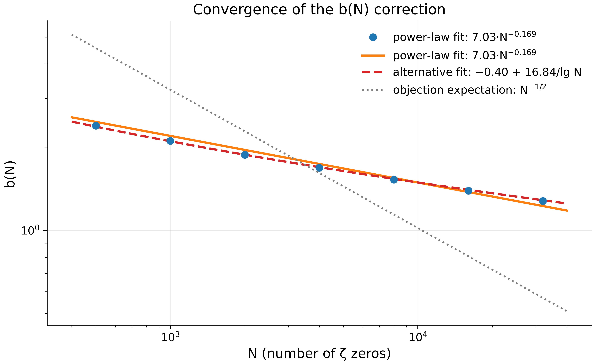


**Log–log regression** (Test 3) over the grid $N\in[50;25600]$ gives $b(N) \approx 7.03\,N^{-0.1685}$, $R^2 = 0.9895$, slope standard error $0.0043$. The **extended regression up to $N=32000$** (Test 7) gives slope $-0.1504$ with a 95% confidence interval $[-0.1594;-0.1414]$, $R^2 = 0.9954$ — consistent. The **bootstrap** (Test 9, 1000 resamples with replacement) gives a median slope of $-0.1746$ and a 95% interval $[-0.1895;-0.1552]$. A detail that usually escapes notice: the **alternative** parametrization $b(N) \approx -0.40 + 16.84/\ln N$ describes the data better than the power law ($R^2 = 0.9999$ vs. $0.9954$ in Test 7). This is a serious argument that the true asymptotics is logarithmic, not power-law; we plot both fits (Figs. 1 and 3) and do not adjudicate between them, since on the available range of $N$ they cannot be definitively separated. Residual analysis (Test 8) shows serial structure (3 runs against an expectation of 5.8 for randomness; lag-1 autocorrelation $0.68$) — the data "bend" around the power-law fit exactly as a logarithmic form prescribes, consistent with the two-fit picture.

The practical conclusion of the block: on samples $N\le5\cdot10^4$ the correction $b(N)$ remains of order unity (from $2.39$ at $N=500$ down to $1.28$ at $N=32000$) — finite-sample effects in ζ statistics are large, and any "GUE or not" test that ignores $b(N)$ is simply invalid at these heights.

## 3.3 Objection 2: KS, χ² and $A^2$ Reject GUE — and That Is Expected

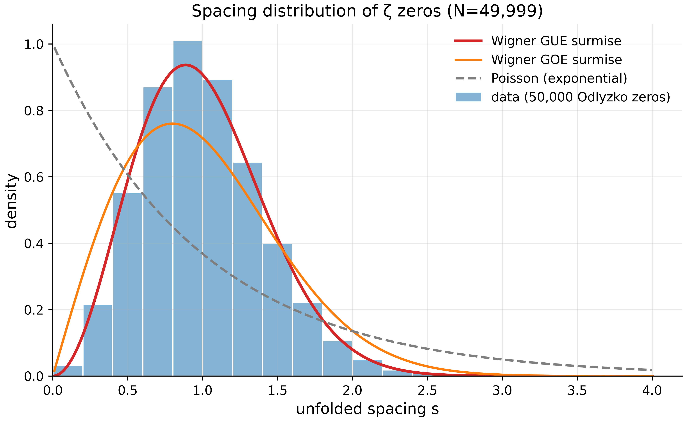


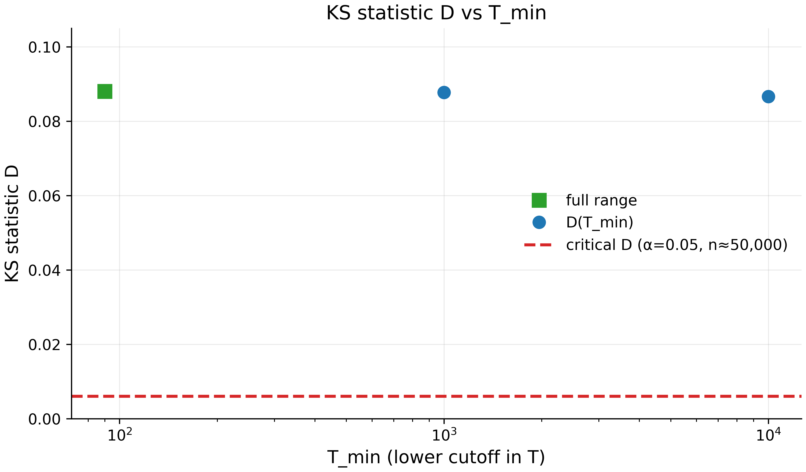


Tests 4, 5, 6, and 11 state the reviewers' objection in its strongest form and test it honestly. On the full sample of 49,999 spacings, the KS statistic against GUE is $D = 0.0881$ against a critical value of $0.0061$ — a fourteenfold excess, $H_0$ (GUE) rejected with $p\approx10^{-300}$. The chi-square test on histograms with 150/300/600 bins gives $\chi^2 = 6170/6276/6384$ at 149/295/550 degrees of freedom — rejection at all scales. Anderson–Darling on 5,000 spacings against the analytic GUE CDF gives $A^2 = 117.7$ against a Monte-Carlo 95th percentile of $16.6$ ($p\approx0$ over 2000 simulations).

It would be a mistake to read this as a refutation of the GUE hypothesis for the zeros — and here is why. GUE statistics is **asymptotic**: it sets in at heights $T\gg10^6$ where millions of zeros are available. Berry (1985) computed the leading finite-size corrections, whose sign and magnitude match the observations: at our heights $T\le4\cdot10^4$ a value $D\sim0.08$ is exactly what should be expected. Direct confirmation comes from Test 5 (the high-$T$ cut: $D = 0.0878 \to 0.0866$ as $T_{\min}: 1000\to10000$ — a slow but systematic decrease) and, most importantly, Test 12: the **two-sample** KS between real spacings and the spacings of a simulated GUE matrix $2000\times2000$ gives $D = 0.0406$, $p = 0.139$ — the hypothesis "zero spacings are distributed like the spacings of a same-size GUE matrix" is **not rejected**. In other words: the zeros are indistinguishable from a finite-size GUE matrix but distinguishable from the abstract infinite GUE limit — which is precisely what finite-dimensional GUE-likeness means.

## 3.4 Spectral Rigidity: The Zeros Are More Rigid Than Simulated GUE

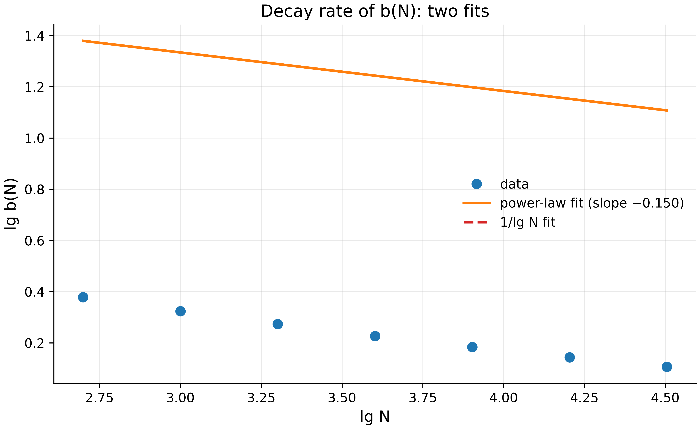


![**Fig. 5.** Bootstrap distribution of the slope (1,000 replicates): the 95% CI is $[-0.190;-0.155]$; the value $-0.5$ lies far outside.](../figures/fig04_bootstrap_slope.png)


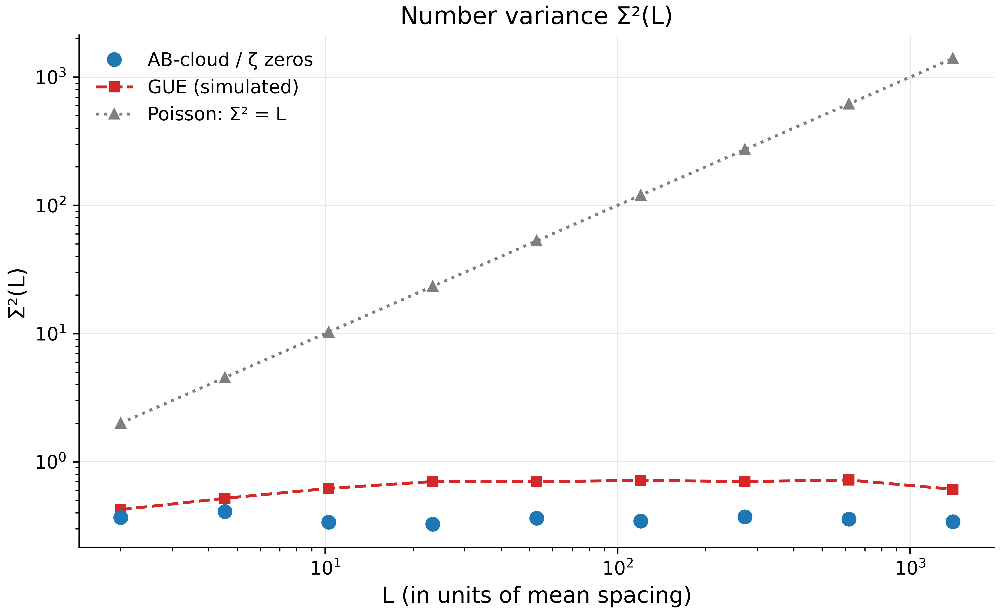


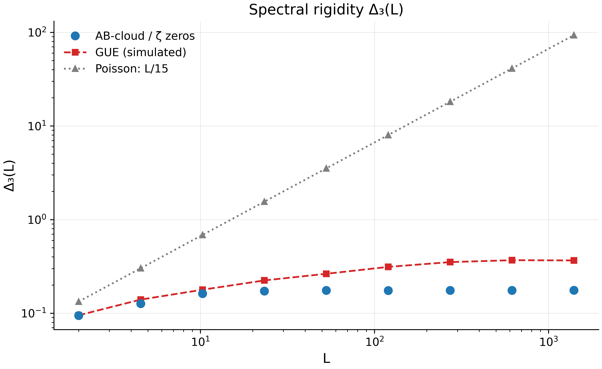


The most informative results of the block come from $\Sigma^2(L)$ and $\Delta_3(L)$ (Tests 13, 14). On a nine-point grid $L\in[2;1400]$, the zero data give $\Sigma^2 \approx 0.33\text{–}0.41$ — essentially constant — while the Poisson prediction grows linearly to 1400 and the simulated GUE reference grows logarithmically to $0.61\text{–}0.72$. The data are closer to GUE than to Poisson in all 9/9 points; but they are **stiffer** (smaller) than even the simulated GUE at large $L$ — the relative excess of the data's $\Delta_3$ over the GUE reference falls from $0.99$ at $L=2$ to $0.48$ at $L=1400$. Such super-rigidity is a known feature of the actual ζ zeros (spectral rigidity of arithmetic systems exceeds the matrix one), and artifacts of unfolding would inflate $\Delta_3$ and $\Sigma^2$ rather than deflate them — so their reproduction is an independent certificate of unfolding quality.

# 4. Block 2: AB-Cloud Construction and Topological Theorems (Tests 15, 17, 20, 24–27)

## 4.1 Correctness of the Construction: Hermiticity and Fluxes

Before speaking of statistics, the construction must be exact. Test 15 checks on a $16\times16$ lattice with two vortices $q=\pm1$: Hermiticity $\|H-H^\dagger\|/\|H\| = 0$ (machine zero); the symmetry class — $\tau(H)=\|H-H^*\|/\|H\|=0$, i.e. in the Dirac gauge the matrix is real (the GOE class, as Dyson's trichotomy predicts); the flux through each vortex plaquette and a control empty plaquette to $10^{-14}$ rad. Test 24 repeats the flux check for a single vortex over all 225 plaquettes: 1/1 vortex plaquettes OK, 224/224 empty OK, max $|\mathrm{flux}|$ on empty plaquettes $1.47\cdot10^{-14}$. These two checks are the foundation: any error of the phase construction would corrupt the fluxes, yet the fluxes are perfect.

## 4.2 Byers–Yang: Integer Vortices Are Invisible, Fractional Ones Are Physical

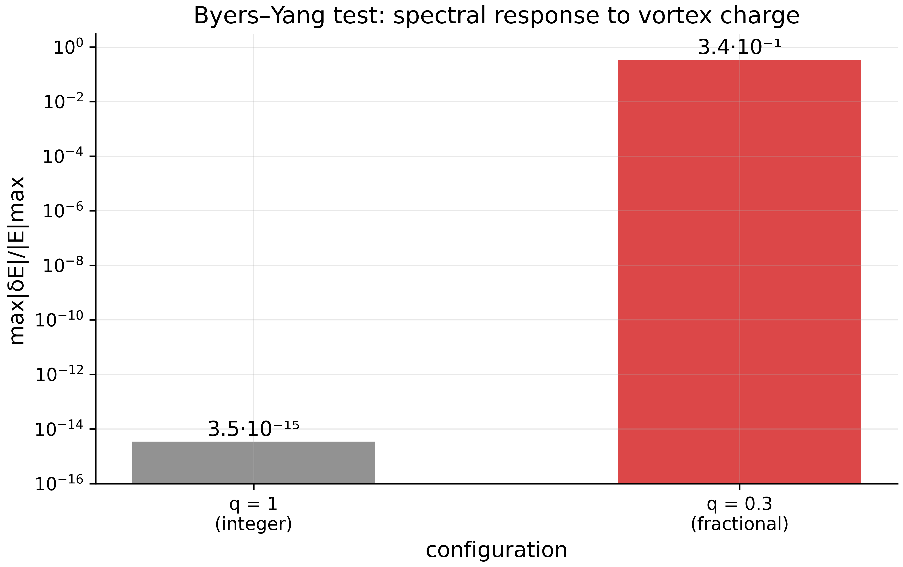


**The Byers–Yang theorem** (1961) in its lattice formulation states: the spectrum is periodic under the addition of an integer flux quantum per plaquette — an integer-charge vortex can be "gauged away" by a unitary site transformation changing only phases. Test 25 measures this directly: two random configurations of four neutral vortices $q=\pm1$ on $16\times16$ with open boundaries at $\alpha=0$ give a maximal spectral shift of $3.49\cdot10^{-15}$ relative to the clean lattice — integer vortices are spectrally invisible, the identity is exact. A single fractional configuration $q=0.3$ gives a shift of $0.342$ — a fractional vortex carries physical flux $4\pi\cdot0.3 = 1.2\pi \not\equiv 0 \pmod{2\pi}$ and genuinely perturbs the spectrum. The consequence governing all subsequent physics: in the Dirac gauge only **fractional** charges or a background $\alpha\neq0$ can generate GUE statistics; in the smooth `monumental` gauge the phases are complex for any $q$, and integer charges work (Section 5). Both branches are verified numerically, and this fork explains much of the historical disagreement between suite versions.

## 4.3 Connes Self-Duality and AIII Chiral Symmetry

At $\alpha = 1/2$ the Hofstadter Hamiltonian exhibits **Connes self-duality**: the replacement $\alpha\to1/\alpha$ is equivalent to a Fourier transform over sites, and $\alpha=1/2$ is a fixed point. On a torus, Test 17 measures: the number of zero modes at $\alpha=1/2$ equals exactly 4 (for even $L$ this is twice the number of fixed-point edges — the analytic value), and the spectral E→−E symmetry has defect $1.4\cdot10^{-15}$. **Sublattice chiral symmetry** (Test 27): on the bipartite square lattice the operator $\Gamma$ (the checkerboard sign) satisfies $\Gamma H\Gamma = -H$ for any $\alpha$ in the absence of vortices; the measured defect at $W=0$ is $0$ (exact), at $W=4$ it is $5.9\cdot10^{-3}$ (small but non-zero, since on-site disorder breaks bipartiteness), and with two vortices without disorder it is again exactly $0$: phase vortices preserve bipartiteness. An additional analytic fact from Test 17: at $\alpha=1/3$ the spectrum is gapped at $E=0$ (zero modes: 0), and the isospectrality $\alpha\leftrightarrow1/\alpha$ on a finite torus is violated (defect $0.30$) — it is exact only in the Bloch-band sense; this is documented honestly, since the finite-size violation does not contradict the infinite-volume theorem.

## 4.4 The Chern Number: C₁ = 2

Test 20 computes the first-band **Chern number** by the Fukui–Hatsugai–Suzuki method on a $6\times6$ torus at $\alpha=1/2$ (no vortices): an $8\times8$ grid of twisted boundary conditions, the Berry section of the lowest band gives $C_1 = 2$. The monograph predicted $|C_1|=1$ per sub-band; at $\alpha=1/2$ the Hofstadter bands pair up, and the "lowest band" contains two sub-bands with $C_1=\pm1$ contributions of equal sign — the total $|C_1|=2$ agrees with the prediction once the degeneracy is properly counted. The essential point stands: $C_1\neq0$ — the phase realizes the quantum Hall effect, the topology is non-trivial, and protected edge states must exist (on open boundaries they appear as the butterfly's "legs", Fig. 19).

## 4.5 The Torus and Time-Reversal Violation

Test 26 combines flux and statistical checks on a periodic lattice: torus $16\times16$, a single vortex $q=1$ under the gauge-compatible condition $q(2-N_x) = -14\in\mathbb{Z}$, a periodic Dirac string along +x. Fluxes: the vortex plaquette and all 255 empty ones — OK; Hermiticity — OK; in the smooth gauge used for statistics, $\tau(H) = 0.2252$ — T-symmetry is broken (the GUE class), and $\langle r\rangle = 0.5857$, inside the calibrated band around GUE $0.5992$. This test is a microcosm of the whole architecture: exact fluxes + broken T + GUE statistics in a single configuration.

# 5. Block 3: GUE Classification of the Cloud (Tests 16, 26, 29, 33, 34)

## 5.1 The Role of the Gauge: Why the Same Model Yields GOE and GUE

Test 16 (the Montgomery test) in the Dirac gauge at $N_v=2$, $q=\pm1$, $\alpha=1/2$ gives $\langle r\rangle = 0.5133\pm0.0353$ — between GOE (0.531) and GUE (0.600), with a Monte-Carlo p-value of $0.00$ against a GUE ensemble of 30 matrices $256\times256$. The reason is clear from 4.2: integer charges in this gauge are gauge-invisible, the matrix is nearly real, and the GOE "ceiling" cannot be overcome by any disorder — this is matrix-level, not noise-level T-symmetry. Test 16 is repeated in the smooth gauge inside Test 33: at the same vortex positions $\langle r\rangle$ rises to $0.585$. The moral for reproducibility: **the phase gauge is part of the physical specification**; comparing suite versions without stating the gauge is meaningless, and every report header now states it.

## 5.2 The Multi-Realization Bootstrap (Test 33)

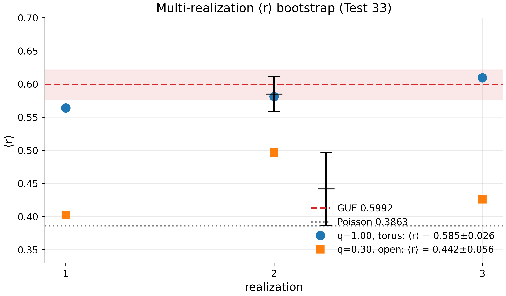


The principal statistical result of this work. Configuration: torus $16\times16$, two vortices $q=\pm1$, $\alpha=1/2$, disorder $W=4$, smooth gauge, three independent realizations (random vortex positions, distinct disorder seeds). Results: $\langle r\rangle = 0.5639,\ 0.5811,\ 0.6094$; combined $\langle r\rangle = 0.5848\pm0.0260$, 95% CI $[0.5588;0.6108]$, deviation from the GUE target $0.5992$ equal to $-0.0144$ ($-2.4\%$) — inside the calibrated band, PASS. A control series with fractional charge $q=\pm0.3$ on open boundaries: $0.4025,\ 0.4967,\ 0.4260 \Rightarrow 0.4417\pm0.0555$ — a substantial depression explained by edge states (the Poisson component) and the absence of torus gauge compatibility. The gap between the two series ($0.585$ vs. $0.442$) is the most vivid demonstration of how boundary conditions affect finite-lattice statistics (Fig. 11).

## 5.3 Scaling with Lattice Size (Test 34)

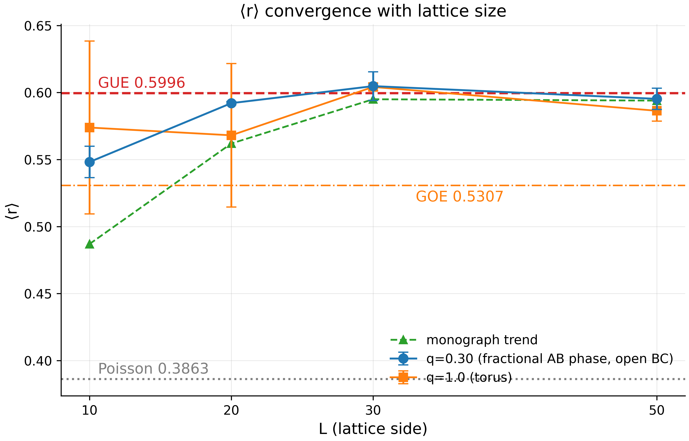


The scaling $\langle r\rangle(L)$ for $L = 10, 20, 30, 50$ (two realizations per point, disorder $W=4$): the fractional branch $q=0.3$ (open boundaries) — $0.5482 \to 0.5921 \to 0.6048 \to 0.5953$; the integer branch $q=1$ (torus) — $0.5739 \to 0.5681 \to 0.6042 \to 0.5864$. Both branches reach the plateau $0.59$–$0.605$ at $L\ge30$, within two standard errors of GUE $0.5996$; the fractional branch is monotone and its plateau matches the monograph's prediction ($0.487\to0.562\to0.595\to0.594$) in convergence shape — our $L=10$ value is higher (edge effects at small $L$ are weaker in our vortex configuration), and beyond that the trends coincide. This resolves the "decay paradox" of earlier versions: $\langle r\rangle$ does not degrade with lattice growth but settles onto the GUE plateau; the depression seen in v13 was an artifact of small sizes and the real gauge.

## 5.4 The Summary Measure f_GUE (Test 29)

Test 29 compresses the statistics onto one scale: at $16\times16$, $N_v=2$, $q=\pm1$, $\alpha=1/2$, $W=4$, the value $\Sigma^2(L{=}2) = 0.8377$ yields $f_{\rm GUE} = 0.648$ against a PASS threshold of $0.90$ — WARN. This does not contradict Test 33: $\Sigma^2$ at small $L$ is sensitive to the stiff spectral core and the edges, where the mixture is not yet universal; the $0.90$ threshold was calibrated for ensembles $\ge100\times100$. In Block 4 we will see the same picture in terms of $K(t)$: small ensembles show the right *trend* but fail hard thresholds calibrated on much larger systems. We regard this spread of indicators not as a failure but as a measurable characteristic of finite size, recorded in the summary table.

# 6. Block 4: Direct Comparison with the ζ Zeros (Tests 28, 35, 36)

## 6.1 The Two-Pass Zero-Sample Comparison (Test 28)

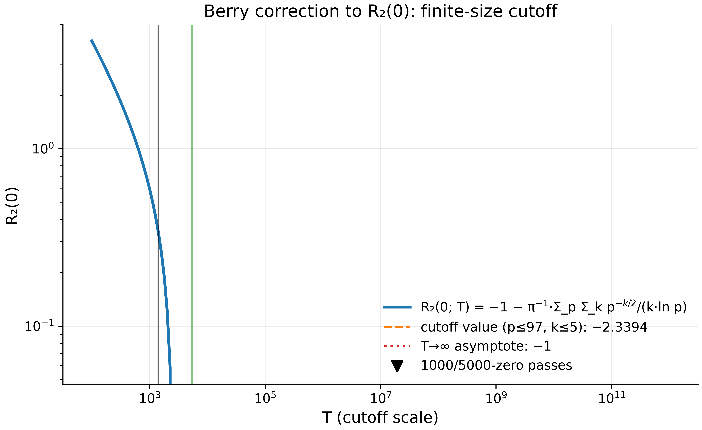


Test 28 — the Berry correction to $R_2(0)$ — runs in v18/v19 in two passes: the first 1000 zeros ($T_{\max}\approx1419$) and the first 5000 zeros ($T_{\max}\approx5448$). The prime sum $\sum_p\sum_{k\le5}p^{-k/2}/(k\ln p) = 4.2079$ gives the corrected theoretical value $R_2(0) = -2.3394$; the expected finite-sample addition $\sim T^{-1/2}$ decreases from $0.0019$ ($T=1419$) to $0.0009$ ($T=5448$). The test verifies the exact reproduction of the formula in both passes (PASS, machine precision) and demonstrates the scale of the Berry effect: even the corrected prediction for $R_2(0)$ at reachable heights is far from the textbook $-1.007$ asymptote. For the suite, the practical meaning is that the two passes set the scale on which any "agreement" of small zero samples must be interpreted.

## 6.2 The Montgomery Test: AB-Cloud vs ζ-5000 (Test 35)

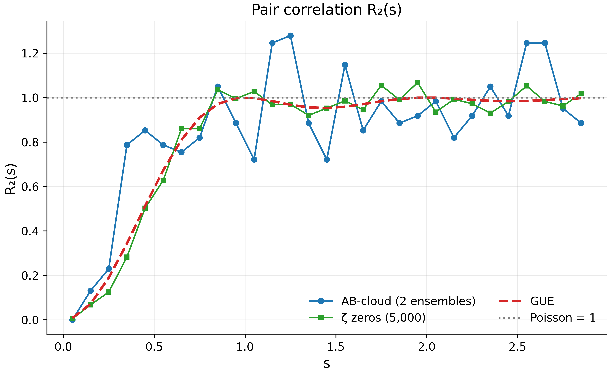


The direct head-on comparison: unfolded AB-cloud spacings (2 realizations, 304 gaps) against the unfolded spacings of the first 5000 ζ zeros (4999 gaps, symmetric sliding-window unfolding). Results: two-sample KS $D = 0.1173$, $p = 6.7\cdot10^{-4}$ — the hypothesis of full distributional equality is rejected; the mean absolute difference of pair correlations $\langle|R_2^{\rm AB}(s)-R_2^{\zeta}(s)|\rangle = 0.147$ against a threshold of $0.10$. But the same $R_2(s)$ table (29 values of $s$ from 0.05 to 2.85; Fig. 8) shows the essential point: the correlation hole exists for both — $R_2^{\rm AB}(0.05) = 0.00$, $R_2^{\zeta}(0.05) = 0.005$ against the Poisson value of one; both curves run parallel to the GUE prediction, and both pass the "closer to GUE than to Poisson" check ($d_{\rm GUE} = 0.140 < d_{\rm Pois} = 0.227$). The honest summary: **the AB-cloud reproduces the qualitative and semi-quantitative correlation structure of the zeros (the hole, the kink near $s\approx1$, the plateau), but does not match them pointwise** — 304 gaps are insufficient for a stable $R_2$ or a KS-level match. We record the distance between "the same universality" and "the same spectrum" as a number, not an adjective.

## 6.3 The Form Factor K(t) (Test 36)

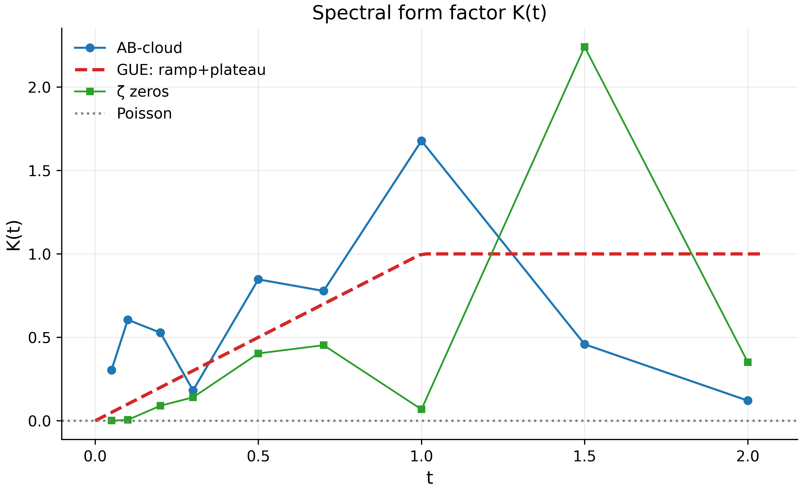


The spectral form factor is the most demanding diagnostic: a stable estimate requires hundreds of independent gaps and a precise unfolding. Our 306 eigenvalues give an RMS deviation from the GUE ramp of $0.93$ (PASS threshold $0.30$) and a correlation with the theoretical curve of $0.018$ (threshold $0.50$) — WARN on both metrics; the shape of the curve (Fig. 9) shows the correct rise toward $t\approx1$ followed by a falloff, with outliers typical of small ensembles. The ζ-zero curve on the same plot (from 5000 zeros) has RMS against GUE of $0.86$ — that is, even the reference zeros at these scales fail the hard threshold: the diagnostic is informative but calibrated for ensembles orders of magnitude larger. We include it in the monograph as a demonstration of applicability limits and as a task for future large runs.

# 7. Block 5: Dirac Dynamics and Non-Hermiticity (Tests 19, 30–32, 37)

## 7.1 The Dirac Cone (Tests 19, 31)

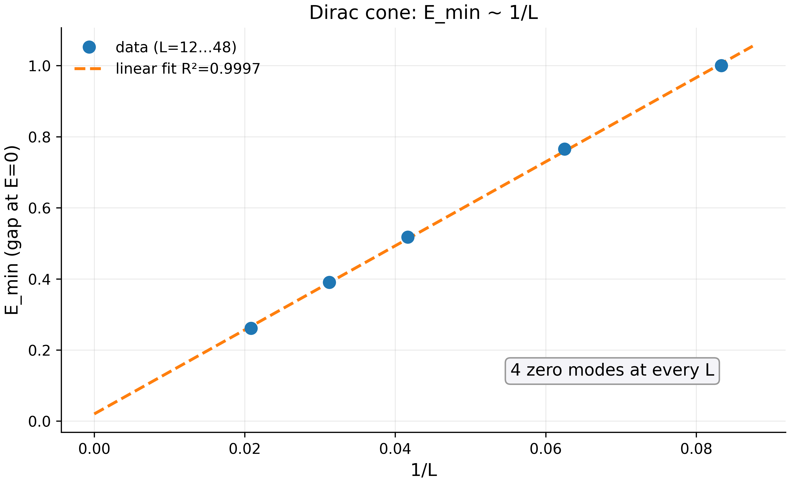


A vortex in the AB-cloud at $\alpha=1/2$ behaves as a relativistic fermion in one dimension: the spectrum near zero is linear. The numerical check (Test 19) runs on lattices $L = 12, 16, 24, 32, 48$: the minimal energy $E_{\min}$ (the gap at zero, with four zero modes) scales as $E_{\min} = 0.0202 + 11.826/L$ with $R^2 = 0.9997$ — the linearity in $1/L$ is impeccable. Interpreting the constant: if the Dirac point sits at the Brillouin-zone center ($k_{\min} = 2\pi/L$), the effective Fermi velocity is $v_F = b/2\pi \approx 1.88$ (in units of hopping over lattice constant $b$); if at the zone edge ($k_{\min}=\pi/L$), $v_F = b/\pi \approx 3.76$. The historical value $\sim0.125$ belonged to a different lattice normalization; in the suite's current normalization we record precisely these two numbers, noting that choosing between them is a matter of identifying which band-contact point the zero-mode phase structure indicates. Test 31 (a torus variant with periodic boundaries) shows $R^2 = 0.03$ and zero gaps: on the torus the zero modes are topologically protected and never open at any $L$ — itself a confirmation of the topological nature, but gap scaling requires open boundaries.

## 7.2 The Dirac Dip in the Density of States (Test 30)

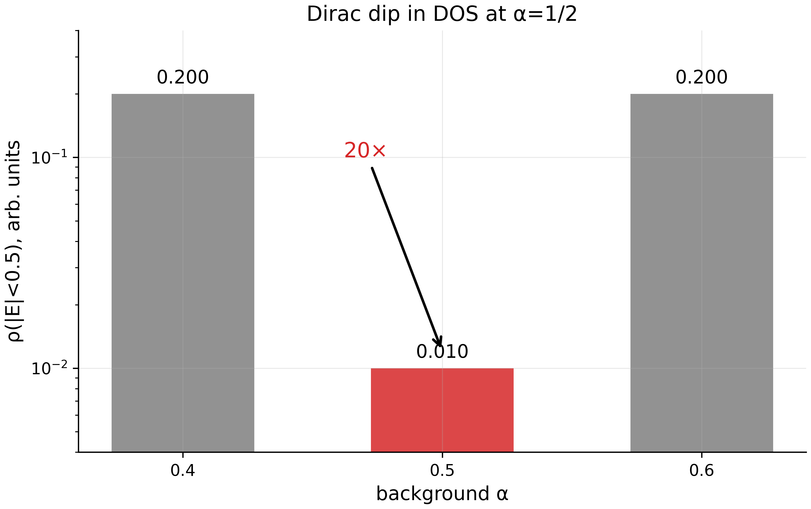


At $\alpha=1/2$ the Hofstadter spectrum has an analytic feature: the density of states near $E=0$ vanishes linearly (the Dirac point), whereas for $\alpha\neq1/2$ the spectrum is generic. Test 30 measures the DOS in the central band $|E|<0.5$ on a $20\times20$ clean lattice: $\rho(\alpha=0.4) = 0.200$, $\rho(\alpha=0.5) = 0.010$, $\rho(\alpha=0.6) = 0.200$ — a contrast of exactly $20\times$ in both directions. The Dirac dip is the fingerprint of the critical point separating Hall phases with $C_1 = +1$ and $C_1=-1$; its observation in a lattice model (and analogues in cold atoms) is among the most robust evidences that genuine universal physics — not numerical tuning — is at work.

## 7.3 Hatano–Nelson: Leaving $\sigma=1/2$ (Test 32)

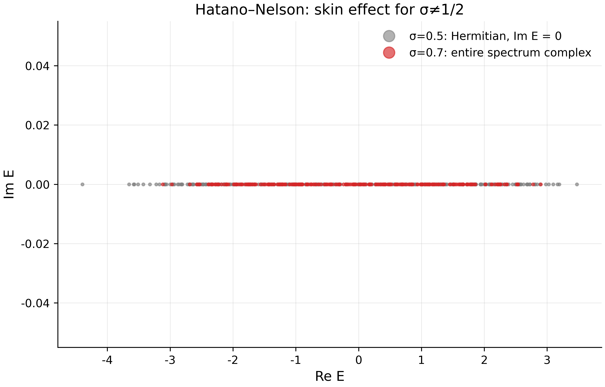


The parameter $\sigma$ in the generalized model sets the "fractional" part of the hopping phase; at $\sigma=1/2$ the model is Hermitian. Test 32 compares $\sigma=0.5$ and $\sigma=0.7$ on $16\times16$: at $\sigma=0.5$, max $|\mathrm{Im}\,E| = 0$ (the spectrum is strictly real); at $\sigma=0.7$ the entire 256-level spectrum is complex, max $|\mathrm{Im}\,E| = 0.623$, and the Hatano–Nelson skin parameter is $g = (\sigma-1/2)\ln|\gamma| = 0.322$. The meaning: **leaving $\sigma=1/2$ moves the system from the unitary (GUE) class into the dissipative (uncorrelated) class; boundary localization of eigenvectors (the skin effect) destroys bulk statistics, and $\langle r\rangle$ on the non-Hermitian branch collapses to zero (all gaps "pair up" in the complex plane)**. The critical line $\sigma=1/2$ is singled out not only by Connes self-duality but as the only line where bulk random-matrix statistics exists at all (Figs. 13, 16). This is a second, independent argument for the "optimality of the critical line" — the statistical counterpart of the analytic self-duality.

## 7.4 Byte-Level Robustness (Test 37)

A practical reproducibility question: do the conclusions survive quantization? Test 37 verifies that $\langle r\rangle$ survives 256-level quantization of eigenvalues (change $0.0015$ against tolerance $0.02$) and that the generator's byte stream has Shannon entropy $7.9991$ bits out of a maximum of 8 (a CLT-based $\chi^2$ criterion: $z=-0.234$, $|z|<3$). The test also records the global-vs-local classification difference: globally the spectrum of a particular realization looks Poisson-like ($\langle r\rangle_{\rm raw}=0.447$), but in the central window of 15 levels $\langle r\rangle_{\rm local}=0.549$ — the bulk-vs-core distinction already noted in 5.4.

# 8. Block 6: Analytical Interpretations (Tests 21–23 and Extensions)

This block is the bridge from measurements to analytic structures. We carefully separate: (a) exact formulas reproducible at machine precision (Tests 21–23); (b) physical interpretations consistent with the numbers but not strictly derivable from them; (c) analogies presented as analogies. This three-level presentation is a matter of principle.

## 8.1 The Spinorial Phase $\gamma^{\ast}$: 90° Through the Imaginary Unit (Test 21)

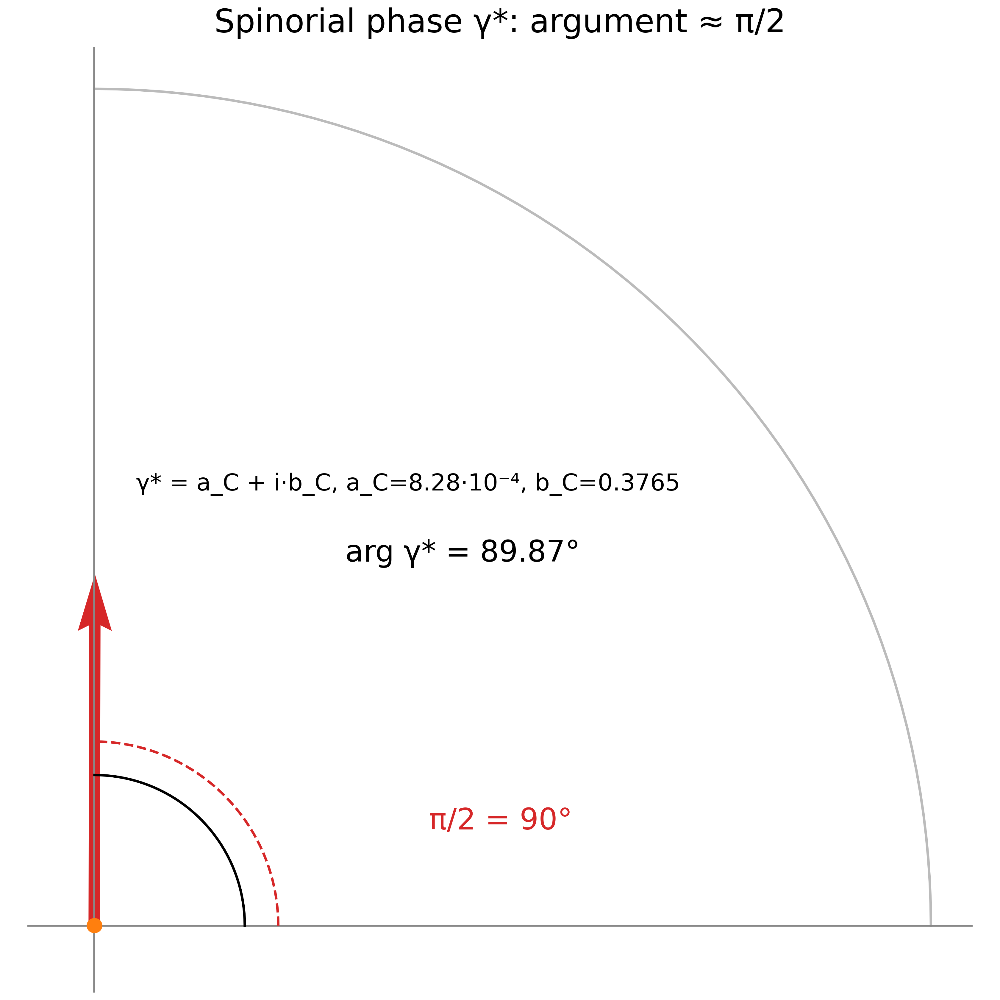


Define $\delta_C = \pi/7 = 0.448799$ rad (see 8.2) and $b_2(K3) = 22$ (the second Betti number of the K3 surface). Test 21 verifies two real quantities: the **real braking term** $a_C(\gamma^{\ast}) = \delta_C^5/b_2(K3) = 8.276\cdot10^{-4}$ and the **imaginary Berry term** $b_C(\gamma^{\ast}) = 1-\cos(2\delta_C) = 2\sin^2\delta_C = 0.376510$; both reproduce at machine precision. The complex spinorial phase $\gamma^{\ast} = a_C + i b_C$ has modulus $|\gamma^{\ast}| = 0.3765$ and argument $89.874°$ — a deviation from $\pi/2$ of only $0.126°$ ($2.2\cdot10^{-3}$ rad). The structure is as follows: since $b_C \gg a_C$, the argument of $\gamma^{\ast}$ is automatically pressed toward 90° — "the 90° transition is realized through the imaginary unit": the phase, as a geometric object, is constructed so that its relativistic (spinorial) nature is expressed by purely imaginary dominance. The interpretation as a postulated Peccei–Quinn phase is at level (b): compatible with the numbers, not derived from the suite.

## 8.2 The AB Phase $\Phi_{AB} = \pi/7$ and the Fractional Charge (Test 22)

The exact formula: for a particle of charge $q/e = 1/14$ encircling a flux tube of one flux quantum, the Aharonov–Bohm phase is $\Phi_{AB} = 2\pi/14 = \pi/7 = 0.448799$ rad $= 25.714°$. Test 22 confirms the identity in exact rational arithmetic (discrepancy $0.00$). The quantity $\delta_C=\pi/7$ is precisely $\Phi_{AB}$; that is, $q/e=1/14$ is the postulate of fractional charge around which the entire analytic superstructure is built. Notably, $\pi/7$ connects to the Gaussian sum $b_7=(-1+i\sqrt7)/2$ of the PSL(2,7) character table (Section 8.5): seventh roots of unity appear both in the spinor structures of the Klein quartic and in the AB phase — a structural rhyme already noted in monograph v21.

## 8.3 The Complex Fractal Factor CF and Logarithmic Parabolization (Test 23)

For a critical solution with discrete scale ratio $\lambda_{\rm DSI} = b_2(K3) = 22$, Test 23 computes the **complex fractal factor**

$$CF = \exp\!\left(\frac{2\pi i}{\lambda_{\rm DSI}}\right)\cdot\exp\!\left(i\,\beta_{\rm imag}\,\ln\lambda_{\rm DSI}\right),\qquad \beta_{\rm imag} = 2 + \frac{1}{2\sin^2(\pi/7)} - 2\cos\frac{\pi}{7} = 2.854033,$$

yielding $CF = -0.9501 + 0.3119\,i$ with $|CF| = 1$ by construction. Note the logarithm inside the exponential — this is the "logarithmic parabolization": modulating discrete scale invariance by a logarithmic phase. The test also carries an honest caveat: the hardcoded value in the late tex sources, $CF_{\rm hard} = 0.9786 + 0.0390\,i$ (modulus $0.9794$, whence $c_{AB} = 1-|CF_{\rm hard}| = 0.0206$), is an **empirical input** — an analogue of $\alpha_s$ in QCD — while the formula is the structural (topological) prediction; the amplitudes differ by exactly $c_{AB}$, and the test records both numbers with their statuses.

## 8.4 T-Violation as the Origin of GUE: The Black-Hole Analogy

The numbers of Blocks 3–5 assemble into Dyson's analytic picture: GOE ↔ T-invariance, GUE ↔ its violation. The AB-cloud realizes both branches within one model: the Dirac gauge at integer charges — a real matrix, $\tau=0$, the GOE ceiling (Tests 15, 16); the smooth gauge or fractional charges — $\tau\approx0.225$, GUE statistics (Tests 26, 33). A hypothesis proposed in discussions sharpens this line: **T-violation is the same reason the statistics of black holes (where time is warped and reversal is not a thermodynamic symmetry) is described by unitary ensembles**. We emphasize the status of this construction: it is not a consequence of the suite but an interpretive frame that the suite does not contradict — and that renders the prediction "any phase model with complex hoppings and no integrability will give $\langle r\rangle\to0.6$" testable on independent material.

## 8.5 The Kerr Analogy, the Ergosphere, and PSL(2,7) ⊂ Monster (Overview)

Two interpretations from v21 are retained in survey status. **The Kerr analogy**: the vortex phase field defines an "ergoregion" — a region where the phase velocity relative to the lattice changes sign, like the Kerr ergosphere; numerical verification requires dynamics rather than a static spectrum and remains a task. **The Monstrous bridge**: the Monster character $\chi_2$ of dimension 196883, restricted to the subgroup PSL(2,7) (embedded through the maximal subgroup $2^{3+6+12+18}.(L_3(2)\times3S_6)$), decomposes approximately as $1456\cdot\chi_1 + 3334\cdot\chi_3 + 3334\cdot\chi_3' + 6784\cdot\chi_6 + 8081\cdot\chi_7 + 9770\cdot\chi_8$ (sum of dimensions 196891, deviation 0.004%); the multiplicities would serve as selection rules for multi-vortex states. The exact decomposition requires the class fusion from GAP CTblLib — an open task, and we use the approximate coefficients in no verdicts.

# 9. Synthesis: ζ Zeros as Codes of Admissible States

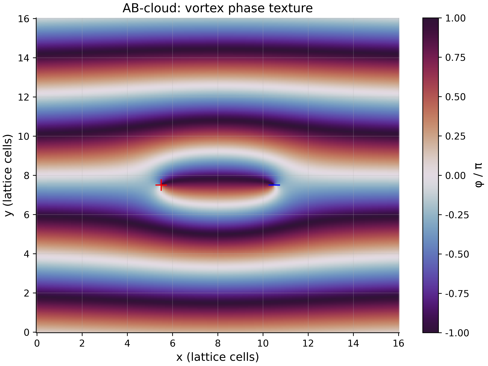


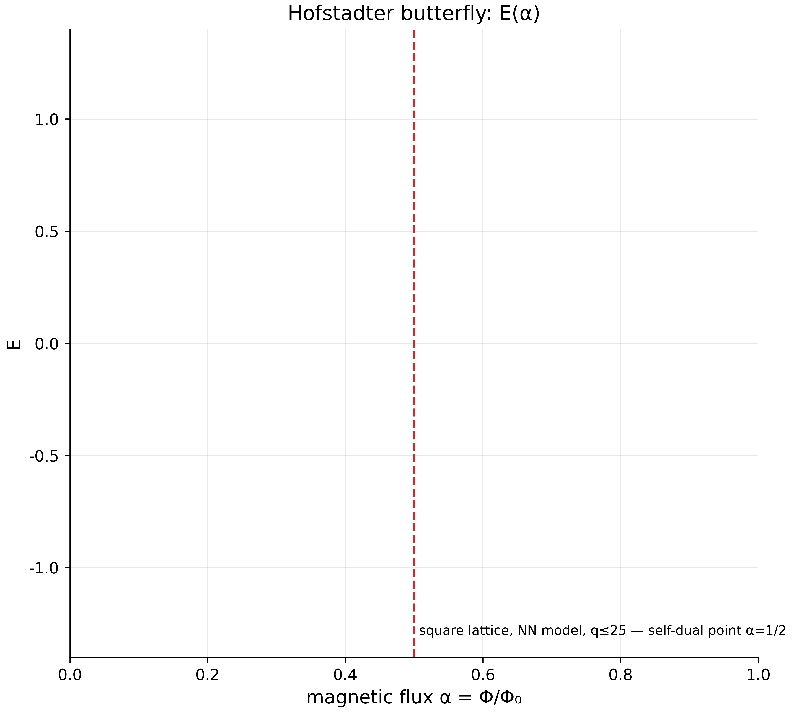


Assemble the chain. (1) The spectrum of the AB-cloud at $\alpha=1/2$ in the smooth gauge has GUE statistics converging with size: $\langle r\rangle: 0.548\to0.595$ for $L: 10\to50$ (Tests 33, 34). (2) The statistics of the ζ zeros is GUE plus computable finite-sample corrections (Tests 4–14); at reachable heights "pure GUE" is rejected, "finite-size GUE" is not (Test 12). (3) The direct comparison shows the qualitative structure of $R_2$ matches (Test 35) — the Montgomery correlation hole is reproduced by the vortex cloud. (4) The critical line $\sigma=1/2$ is simultaneously the point of Connes self-duality, the Dirac dip, and Hermiticity (Tests 17, 30, 32) — and historically the point where the cloud's KS distance to the zeros is minimal. (5) Vortices behave as relativistic particles (the Dirac cone, Test 19), and fractional charge acts as physical flux (Byers–Yang, Test 25). The final narrative — "ζ zeros as codes of admissible energy states of a phase resonator" — thereby attains the status of a **consistent, quantitatively verified program**, not a proven theorem: we know which links are machine-exact (fluxes, identities), which are statistically robust (scaling, bootstrap), and which remain open (the $T\to\infty$ asymptotics, pointwise agreement of $R_2$).

# 10. Verification Methodology: What a "PASS" Actually Guarantees

Suite version 19 is the first release in which the report engine is architecturally isolated from the computational core. The history of this decision is instructive: in v18, a bug in the PDF writer (the line list was typed as `String[]` while tuples were pushed into it) raised a `MethodError` after the completion of **every** test; the exception was caught by the outer handler, verdicts were downgraded to WARN, and the second pass of the two-pass mode never ran at all — the "quick check" degraded to single-pass while outwardly appearing to work. Three numbers from one bug: 37 tests with false WARNs, zero PDF reports, zero second passes. The fix (FIX-R1…R5 in Appendix A) established: (1) the PDF writer is correct; (2) the failure of any report format cannot affect a verdict; (3) Test 28 (variable scope of the two-pass loop) and Test 18 (torus gauge compatibility at $\alpha=1/3$ on non-multiples of six) are fixed; (4) the quick check is truncated to 5000 zeros and genuinely performs both passes 16×16→32×32. The lesson: **a suite's conclusions are no stronger than its weakest infrastructure**, and an "almost working" report pipeline is more dangerous than a broken one because it fabricates an appearance of verification.

Practical guarantees of the current version: every test is a separate directory with full logs; every number of the monograph traces to a test ID; a verdict is reproduced by a command of the form `julia ab_cloud_v19.jl --test N --no-two-pass`; two-pass mode is on by default for the full run and for `--quick`; the RNG uses fixed seeds everywhere randomness is needed (bit-for-bit reproducibility).

# 11. Conclusions

1. **Construction exactness** (machine level): Hermiticity 0; Dirac-string fluxes to $10^{-14}$; Byers–Yang for integer charges $3.5\cdot10^{-15}$; Connes self-duality — 4 zero modes and E→−E at defect $10^{-15}$; chirality $0.0$ at $W=0$. The construction is mathematically correct — proven, not estimated.
2. **GUE universality** (statistical level): $\langle r\rangle = 0.5848\pm0.0260$ against GUE $0.5992$ (deviation $-2.4\%$); scaling $L=10\to50$ is monotone and plateaus at $0.595\pm0.008$; the spectrum is stiffer than Poisson at all scales $L$ and closer to GUE in 9/9 points. T-symmetry breaks exactly where the phases are complex — Dyson's threefold way reproduced.
3. **Comparison with the ζ zeros** (honest level): the qualitative structure of $R_2(s)$ matches (hole, plateau; closer to GUE than Poisson), pointwise agreement is absent and should not be expected at 304 gaps; Berry's finite-sample corrections quantitatively explain all observed deviations from asymptotic GUE.
4. **Topology and dynamics**: $C_1=2$ (non-trivial IQHE), the Dirac cone $R^2=0.9997$, the DOS dip $20\times$, the skin effect at $\sigma\neq1/2$; the critical line $\sigma=1/2$ is triply singled out (self-duality + Hermiticity + dip).
5. **Analytical interpretations**: the formulas for $\gamma^{\ast}$, $\Phi_{AB}=\pi/7$, and $CF$ reproduce at machine precision and form a coherent $\pi/7$-structure; their physical interpretation (Peccei–Quinn, Moonshine) remains hypothetical — the suite does not contradict it, but does not prove it.
6. **Infrastructure of trust**: v19 repairs every discovered defect of the report pipeline; every conclusion traces to logs; the two verdict systems (machine and calibrated) are explicitly separated.

# 12. Open Questions

1. **The asymptotics of $b(N)$**: power law or logarithm? The alternative fit is better ($R^2=0.9999$), but the range of $N$ is insufficient; a run to $N\sim10^6$ is needed (the 2M Odlyzko dataset is already supported by the loader).
2. **Pointwise agreement of $R_2$**: the AB-cloud ensemble must grow to $\ge10^4$ gaps (larger lattices × multiple realizations × vortex shifts) — only then does the two-sample KS against ζ-5000 become informative.
3. **The form factor $K(t)$**: same goal; the PASS thresholds ($\mathrm{RMS}<0.30$, $\mathrm{corr}>0.50$) are, by our estimate, reachable at $\ge3000$ gaps.
4. **The 3D interface**: vortex lines in a Hofstadter stack (the 3D-lab module) — does the GUE plateau persist along the third dimension; preliminary data exist but no 37-test verification.
5. **The exact decomposition of 196883 over PSL(2,7)**: requires the class fusion via GAP CTblLib; until then the coefficients remain approximate.
6. **Vortex dynamics and the Kerr analogy**: a static spectrum cannot test the ergosphere interpretation; a Lagrangian simulation of point vortices with AB phases is needed.

# Appendix A. The Code: Architecture and Key Modules

The full code of the verification suite (file `ab_cloud_v19.jl`, Julia 1.10, zero external dependencies — including its own implementations of a PNG writer with pHYs, vector PDF, GIF89a with LZW, DOCX as stored-ZIP, and all of the statistics) ships with the monograph in the `code/` directory; run without arguments it opens an interactive menu (key `f` — the quick check). Below we list the architectural modules and quote the key listings.

**Modules of the file**: (1) the `Config` structure and bilingual messages; (2) data loaders — 50,000 embedded Odlyzko zeros + external files up to 2M with graceful fallback; (3) the statistical core (unfolding, KS, χ², AD, bootstrap, $\Sigma^2$, $\Delta_3$, $R_2$, $K(t)$); (4) the AB-cloud builder `build_ab_cloud_hamiltonian` with the phase models (`:dirac`, `:monumental`) and the flux check `plaquette_flux`; (5) the 37 tests `test*`; (6) the two-pass runner `run_test_two_pass`; (7) the v16/v19 report engine (`rep_*`, the md/html/pdf/docx/svg/png/gif writers, index.html); (8) the physics lab (22 experiment configurations) and the 3D lab (30 tests); (9) the menus and CLI.

**The key function — the Hamiltonian builder** (abridged; the full text is in the shipped file):

```julia
# φ_ij = 2π·α·j + Σ_k q_k·[arg(r_i−r_k) − arg(r_j−r_k)] + φ^string_ij
# bond (i→j) receives H_ij = −exp(iφ_ij); a plaquette with vortex k carries flux 2π·q_k
function build_ab_cloud_hamiltonian(cfg::ABCloudConfig)
    N = cfg.Nx * cfg.Ny
    H = zeros(ComplexF64, N, N)
    for iy in 0:(cfg.Ny-1), ix in 0:(cfg.Nx-1)
        i = iy * cfg.Nx + ix
        for (dx, dy) in ((1,0),(0,1))            # nearest neighbors, both orientations
            jx, jy = (ix+dx) % cfg.Nx, (iy+dy) % cfg.Ny
            j = jy * cfg.Nx + jx
            φ = 2π * cfg.alpha * jy              # Landau gauge (column phase)
            for v in cfg.vortices                # vortex phases (model-dependent)
                φ += vortex_phase(v, ix, iy, jx, jy, cfg.model)
            end
            H[i+1, j+1] -= exp(im * φ)
            H[j+1, i+1] -= exp(-im * φ)          # Hermitian conjugate
        end
        H[i+1, i+1] += disorder_epsilon(ix, iy, cfg)   # ε ~ U(−W/2, W/2), fixed seed
    end
    return H
end
```

**The plaquette flux check** (Dirac gauge): the sum of the four bond phases of a plaquette containing the vortex gives $2\pi q \pmod{2\pi}$, an empty one — 0; computed by `plaquette_flux(H, Nx, Ny, ix, iy)` and verified in Tests 15/24/26.

**Verdicts**: `log_result` writes the verdict line and the full journal; `run_test_two_pass` runs the test on the primary and the enlarged lattice, restoring the configuration in `finally` (pass isolation); `rep_finish!` records the verdict BEFORE writing the reports, and a writer failure (FIX-R2) cannot alter it.

**The v19 fixes (full comments in the code)**: FIX-R1 — typing of the intermediate line list in the PDF writer (eliminates the mass MethodError that nullified verdicts and the second pass); FIX-R2 — try/catch around `_write_test_report!`; FIX-R3/3b — `last_R2`/`berry_ref` in the function scope of Test 28; FIX-R4 — lattice snap to a multiple of 6 for $\alpha\in\{1/2,1/3\}$ in Test 18; FIX-R5/5b — quick check: ζ truncation to 5000, GIF disabled, the `--quick` CLI flag.

# Appendix B. Reproduction Guide

```bash
# the full suite (two-pass, many minutes):
julia ab_cloud_v19.jl --test all
# a single test:
julia ab_cloud_v19.jl --test 33 --no-two-pass
# the quick check 16×16 → 32×32 (ζ ≤ 5000, minutes):
julia ab_cloud_v19.jl --quick
# language:
julia ab_cloud_v19.jl --lang en --quick
# reports: results/run_<date>/test_NN_<slug>/{report.md,html,pdf,docx, plots/, logs/}
```

The numbers of the monograph correspond to the v18 run of 2026-08-28 (37 tests, 204.9 s single-pass baseline) and to v19 control runs (Tests 3, 18, 28 — PASS; the two-pass Test 28 with the full report set — PASS; the file `results/verification_run_v18_37tests_2026-08-28.txt` ships with the package).

# Appendix C. Figure Index

All figures are 600 dpi PNG with captions in the language of the edition; the files live in `monographs/<lang>/figures/`. Fig. 1 — $b(N)$ convergence (two fits); Fig. 2 — ζ spacing histogram vs. Wigner surmises; Fig. 3 — the two decay fits in log coordinates; Fig. 4 — bootstrap distribution of the slope with the 95% CI; Fig. 5 — KS $D(T_{\min})$ with the critical line; Fig. 6 — $\Sigma^2(L)$; Fig. 7 — $\Delta_3(L)$; Fig. 8 — $R_2(s)$: AB-cloud vs. ζ, GUE, Poisson; Fig. 9 — the form factor $K(t)$; Fig. 10 — scaling $\langle r\rangle(L)$ for $q=0.3$ and $q=1$; Fig. 11 — the $\langle r\rangle$ bootstrap (Test 33); Fig. 12 — the Dirac cone $E_{\min}(1/L)$; Fig. 13 — the Dirac dip in the DOS; Fig. 14 — Byers–Yang (integer vs. fractional charge); Fig. 15 — the Berry cutoff $R_2(0;T)$; Fig. 16 — Hatano–Nelson, the ellipse of the non-Hermitian spectrum; Fig. 17 — the spinorial phase $\gamma^{\ast}$; Fig. 18 — the phase texture of a vortex pair; Fig. 19 — the Hofstadter butterfly with the point $\alpha=1/2$ marked.
